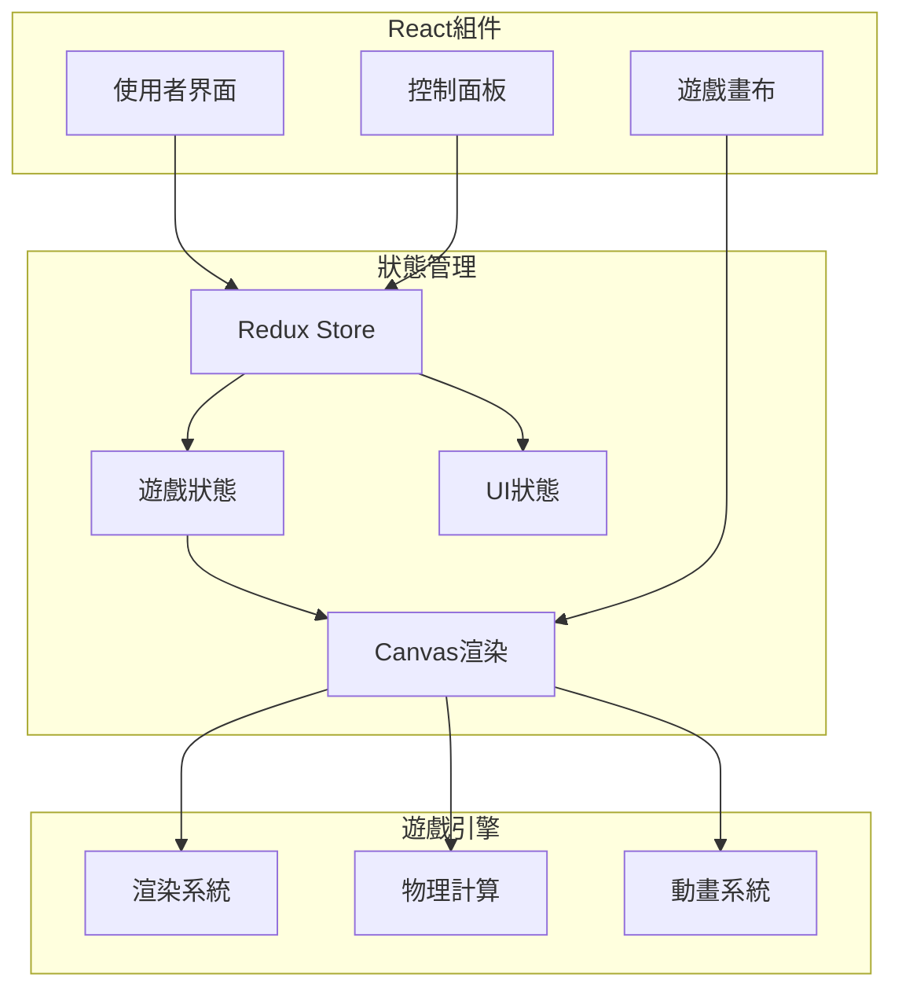

**User:**

<task>
請根據 已完成的項目、目前進度、選擇依賴性最少的工作，當作接下來的工作。開始進行之前，先更新 memory bank 的文件記錄預計要進行的項目，以防萬一工作到一半中斷導致不知道進度。
</task>
<environment_details>
# VSCode Visible Files
../../../../mnt/c/Users/ben.chang/AppData/Local/Programs/Microsoft VS Code/memory-bank/techContext.md
../../../../mnt/c/Users/ben.chang/AppData/Local/Programs/Microsoft VS Code/memory-bank/techContext.md
.cline/tasks/cline_task_mar-28-2025_11-11-51-am.md

# VSCode Open Tabs
memory-bank/05_activeContext.md
src/utils/SatisfactionManager.ts
jest.config.ts
jest.setup.ts
src/utils/__tests__/SatisfactionManager.test.ts
package.json
memory-bank/04_techContext.md
memory-bank/06_progress.md
.gitignore
.cline/tasks/cline_task_mar-28-2025_11-11-51-am.md

# Current Time
3/28/2025, 11:13:40 AM (Asia/Taipei, UTC+8:00)

# Current Working Directory (/home/ben/github.com/theme-park-simulator) Files
🔒 .clineignore
.clinerules
.gitignore
eslint.config.js
index.html
jest.config.ts
jest.setup.ts
package-lock.json
package.json
README.md
tsconfig.app.json
tsconfig.json
tsconfig.node.json
vite.config.ts
memory-bank/
memory-bank/01_projectbrief.md
memory-bank/02_productContext.md
memory-bank/03_systemPatterns.md
memory-bank/04_techContext.md
memory-bank/05_activeContext.md
memory-bank/06_progress.md
public/
public/vite.svg
src/
src/App.css
src/App.tsx
src/index.css
src/main.tsx
src/vite-env.d.ts
src/assets/
src/assets/react.svg
src/components/
src/components/game/
src/components/shared/
src/components/ui/
src/engine/
src/hooks/
src/store/
src/utils/
src/utils/SatisfactionManager.ts
src/utils/__tests__/
src/utils/__tests__/SatisfactionManager.test.ts
tests/
tests/dialog-demo/
tests/dialog-demo/.gitignore
tests/dialog-demo/cypress.config.mjs
tests/dialog-demo/eslint.config.js
tests/dialog-demo/index.html
tests/dialog-demo/package-lock.json
tests/dialog-demo/package.json
tests/dialog-demo/README.md
tests/dialog-demo/tsconfig.app.json
tests/dialog-demo/tsconfig.json
tests/dialog-demo/tsconfig.node.json
tests/dialog-demo/vite.config.ts
tests/dialog-demo/cypress/
tests/dialog-demo/cypress/e2e/
tests/dialog-demo/cypress/e2e/dialog.cy.ts
tests/dialog-demo/cypress/snapshots/
tests/dialog-demo/cypress/snapshots/dialog.cy.ts/
tests/dialog-demo/cypress/snapshots/dialog.cy.ts/dialog-shown.png
tests/dialog-demo/cypress/snapshots/dialog.cy.ts/initial-state.png
tests/dialog-demo/cypress/snapshots/dialog.cy.ts/message-1.png
tests/dialog-demo/cypress/snapshots/dialog.cy.ts/message-2.png
tests/dialog-demo/cypress/snapshots/dialog.cy.ts/message-3.png
tests/dialog-demo/cypress/snapshots/dialog.cy.ts/typing-state.png
tests/dialog-demo/cypress/support/
tests/dialog-demo/cypress/support/e2e.ts
tests/dialog-demo/public/
tests/dialog-demo/public/vite.svg
tests/dialog-demo/src/
tests/dialog-demo/src/App.css
tests/dialog-demo/src/App.tsx
tests/dialog-demo/src/index.css
tests/dialog-demo/src/main.tsx
tests/dialog-demo/src/vite-env.d.ts
tests/dialog-demo/src/assets/
tests/dialog-demo/src/assets/react.svg
tests/dialog-demo/src/components/
tests/dialog-demo/src/components/game/
tests/dialog-demo/src/components/game/GameCanvas.tsx
tests/dialog-demo/src/components/ui/
tests/dialog-demo/src/components/ui/DialogInput.tsx
tests/dialog-demo/src/hooks/
tests/dialog-demo/src/hooks/useAppDispatch.ts
tests/dialog-demo/src/hooks/useAppSelector.ts
tests/dialog-demo/src/store/
tests/dialog-demo/src/store/dialogSlice.ts
tests/dialog-demo/src/store/index.ts
tests/dialog-demo/src/utils/

# Current Mode
ACT MODE
</environment_details>

---

**Assistant:**

<thinking>
我需要先檢查 memory bank 中所有必要的文件，讓我依序讀取。
</thinking>

<read_file>
<path>memory-bank/01_projectbrief.md</path>
</read_file>

---

**User:**

[read_file for 'memory-bank/01_projectbrief.md'] Result:
# 主題公園模擬器 (Theme Park Simulator) - 專案簡介

## 專案願景
開發一個簡潔但深度的主題公園模擬器，專注於遊樂設施建造和遊客行為模擬，提供有趣且直觀的遊戲體驗。

## 核心目標
1. 實現直觀的遊樂設施建造系統
2. 打造真實的遊客行為模擬
3. 建立合理的滿意度機制
4. 創造具有挑戰性的遊戲體驗

## 預期功能

### 遊樂設施建造
- 多種遊樂設施類型
- 設施位置規劃
- 設施容量設定
- 設施運營管理

### 遊客行為模擬
- 遊客滿意度系統
  - 初始滿意度 100%
  - 排隊等待降低滿意度
  - 完成遊玩提升滿意度 10%
  - 滿意度低於 50% 尋找新設施
  - 連續三次低滿意度離場
- 智能路徑選擇
- 即時反饋機制

## 核心機制

### 滿意度系統
1. 遊客初始滿意度為 100%
2. 根據排隊時間動態調整滿意度
3. 完成設施遊玩後提升 10% 滿意度
4. 當設施滿意度降至 50% 以下，遊客尋找新設施
5. 連續三項設施滿意度低於 50%，遊客離開園區

### 可調整參數
- 滿意度下降速率
- 滿意度提升幅度
- 臨界滿意度值
- 連續失敗次數限制

## 成功指標
1. 遊客行為模擬的真實性
2. 滿意度機制的平衡性
3. 建造系統的易用性
4. 遊戲體驗的流暢度

## 階段規劃
1. 基礎建造系統
2. 遊客 AI 實現
3. 滿意度機制開發
4. 遊戲平衡調整
5. 效能優化

## 技術需求
- 高效的遊客 AI 系統
- 即時的滿意度計算
- 流暢的建造介面
- 穩定的遊戲性能

<environment_details>
# VSCode Visible Files
../../../../mnt/c/Users/ben.chang/AppData/Local/Programs/Microsoft VS Code/memory-bank/techContext.md
../../../../mnt/c/Users/ben.chang/AppData/Local/Programs/Microsoft VS Code/memory-bank/techContext.md
.cline/tasks/cline_task_mar-28-2025_11-11-51-am.md

# VSCode Open Tabs
memory-bank/05_activeContext.md
src/utils/SatisfactionManager.ts
jest.config.ts
jest.setup.ts
src/utils/__tests__/SatisfactionManager.test.ts
package.json
memory-bank/04_techContext.md
memory-bank/06_progress.md
.gitignore
.cline/tasks/cline_task_mar-28-2025_11-11-51-am.md

# Current Time
3/28/2025, 11:13:47 AM (Asia/Taipei, UTC+8:00)

# Current Mode
ACT MODE
</environment_details>

---

**Assistant:**

<read_file>
<path>memory-bank/02_productContext.md</path>
</read_file>

---

**User:**

[read_file for 'memory-bank/02_productContext.md'] Result:
# 產品背景與上下文

## 問題陳述
現有的主題公園模擬遊戲通常存在以下問題：
- 遊客行為過於簡化
- 滿意度系統缺乏深度
- 設施建造不夠直觀
- 遊戲機制過於複雜

## 解決方案
我們的主題公園模擬器專注於核心玩法：

### 深度滿意度系統
- 動態滿意度計算
- 真實的排隊體驗
- 多層次的決策機制
- 可調整的參數系統

### 智能遊客行為
- 基於滿意度的決策系統
  - 滿意度低於 50% 時尋找新設施
  - 連續三次失敗後離開園區
  - 完成遊玩後滿意度提升
- 即時路徑規劃
- 動態反應機制

### 設施建造系統
- 簡單直觀的建造介面
- 彈性的位置規劃
- 容量管理功能
- 即時效果預覽

## 使用者體驗目標

### 易於理解
- 清晰的滿意度顯示
- 直觀的建造操作
- 即時的遊客反饋
- 簡潔的介面設計

### 深度遊戲性
- 策略性的設施規劃
- 動態的遊客流量
- 滿意度平衡挑戰
- 園區佈局優化

### 視覺回饋
- 遊客情緒表現
- 設施運營狀態
- 排隊區域顯示
- 滿意度變化指示

### 操作流暢度
- 快速的建造工具
- 即時的狀態更新
- 順暢的鏡頭控制
- 靈敏的互動響應

## 目標受眾
1. 休閒遊戲玩家
2. 模擬遊戲愛好者
3. 策略遊戲玩家
4. 管理遊戲愛好者

## 競爭優勢
1. 專注於核心玩法
2. 深度的滿意度系統
3. 真實的遊客行為
4. 簡潔的建造機制

## 預期效果

### 遊客行為
- 自然的移動路徑
- 合理的決策邏輯
- 真實的情緒反應
- 動態的群體行為

### 遊戲平衡
- 合理的等待時間
- 平衡的滿意度變化
- 適當的遊玩難度
- 靈活的參數調整

### 使用者反饋
- 即時的狀態顯示
- 清晰的問題提示
- 直觀的操作響應
- 豐富的視覺回饋

<environment_details>
# VSCode Visible Files
../../../../mnt/c/Users/ben.chang/AppData/Local/Programs/Microsoft VS Code/memory-bank/techContext.md
../../../../mnt/c/Users/ben.chang/AppData/Local/Programs/Microsoft VS Code/memory-bank/techContext.md
.cline/tasks/cline_task_mar-28-2025_11-11-51-am.md

# VSCode Open Tabs
memory-bank/05_activeContext.md
src/utils/SatisfactionManager.ts
jest.config.ts
jest.setup.ts
src/utils/__tests__/SatisfactionManager.test.ts
package.json
memory-bank/04_techContext.md
memory-bank/06_progress.md
.gitignore
.cline/tasks/cline_task_mar-28-2025_11-11-51-am.md

# Current Time
3/28/2025, 11:13:53 AM (Asia/Taipei, UTC+8:00)

# Current Mode
ACT MODE
</environment_details>

---

**Assistant:**

<read_file>
<path>memory-bank/03_systemPatterns.md</path>
</read_file>

---

**User:**

[read_file for 'memory-bank/03_systemPatterns.md'] Result:
# 系統架構與設計模式

## 系統架構概覽



## 核心設計模式

### 1. Flux 架構
- 使用 Redux 單向數據流
- Action 觸發狀態更新
- Reducer 處理狀態變化
- Selector 優化性能

### 2. 組件化設計
- 功能組件優先
- Props 類型定義
- 自定義 Hooks
- 組件複用策略

### 3. 狀態管理
- Redux 集中管理
- 本地狀態管理
- 緩存策略
- 性能優化

### 4. 觀察者模式
- 事件訂閱系統
- 狀態變更通知
- 組件間通信
- 異步處理

## 主要系統組件

### Canvas 引擎
- 場景管理
- 精靈系統
- 碰撞檢測
- 動畫控制

### 遊戲邏輯
- 遊客行為
- 設施運營
- 經濟系統
- 天氣效果

### UI系統
- 控制面板
- 狀態顯示
- 互動選單
- 反饋系統

## 數據流架構


## 擴展性考慮

### 模組化設計
- 高內聚低耦合
- 插件式架構
- 動態載入
- 配置驅動

### 效能優化
- 記憶體管理
- 渲染優化
- 狀態更新優化
- 事件節流

### 可測試性
- 單元測試
- 組件測試
- 狀態測試
- 效能測試

## 主要設計原則

### 組件設計
```typescript
// 功能組件範例
interface AttractionProps {
  id: string;
  position: Vector2D;
  onSelect: (id: string) => void;
}

const Attraction: React.FC<AttractionProps> = ({
  id,
  position,
  onSelect
}) => {
  // 組件實現
};
```

### 狀態管理
```typescript
// Redux Slice 範例
const gameSlice = createSlice({
  name: 'game',
  initialState,
  reducers: {
    updateVisitors: (state, action) => {
      state.visitors = action.payload;
    },
    addAttraction: (state, action) => {
      state.attractions.push(action.payload);
    }
  }
});
```

### Canvas 管理
```typescript
// Canvas 管理器範例
class CanvasManager {
  private context: CanvasRenderingContext2D;
  private entities: Entity[];

  public render(): void {
    // 渲染實現
  }

  public update(deltaTime: number): void {
    // 更新邏輯
  }
}

<environment_details>
# VSCode Visible Files
../../../../mnt/c/Users/ben.chang/AppData/Local/Programs/Microsoft VS Code/memory-bank/techContext.md
../../../../mnt/c/Users/ben.chang/AppData/Local/Programs/Microsoft VS Code/memory-bank/techContext.md
.cline/tasks/cline_task_mar-28-2025_11-11-51-am.md

# VSCode Open Tabs
memory-bank/05_activeContext.md
src/utils/SatisfactionManager.ts
jest.config.ts
jest.setup.ts
src/utils/__tests__/SatisfactionManager.test.ts
package.json
memory-bank/04_techContext.md
memory-bank/06_progress.md
.gitignore
.cline/tasks/cline_task_mar-28-2025_11-11-51-am.md

# Current Time
3/28/2025, 11:13:59 AM (Asia/Taipei, UTC+8:00)

# Current Mode
ACT MODE
</environment_details>

---

**Assistant:**

<read_file>
<path>memory-bank/04_techContext.md</path>
</read_file>

---

**User:**

[read_file for 'memory-bank/04_techContext.md'] Result:
# 技術背景與環境

## 技術棧選擇

### 核心技術
- **前端框架**: React 18.2
- **狀態管理**: Redux Toolkit 2.2
- **渲染引擎**: Canvas API
- **版本控制**: Git

### 開發工具
- **IDE**: Visual Studio Code
- **版本管理**: GitHub
- **專案管理**: GitHub Projects
- **文件管理**: Markdown
- **建置工具**: Vite 5.4
- **測試框架**:
  - Jest 29.7 (單元測試)
  - Cypress 13.6 (端到端測試)

### 第三方框架
- **UI Framework**: Material-UI (MUI) 5.15
- **動畫**: GSAP 3.12
- **樣式**: Emotion 11.11
- **遊戲引擎**: Custom Canvas Engine
- **路由**: React Router

## 開發環境設置

### 系統要求
- **Node.js**: 20.12.0 或更高版本
- **npm**: 10.0.0 或更高版本
- **瀏覽器**: 支援最新版本的 Chrome/Firefox/Safari

### 開發工具安裝
1. Node.js 和 npm
2. Visual Studio Code
3. Git
4. 瀏覽器開發者工具

### 環境配置
```json
{
  "node": ">=20.12.0",
  "dependencies": {
    "@emotion/react": "^11.11.3",
    "@emotion/styled": "^11.11.0",
    "@mui/material": "^5.15.11",
    "@reduxjs/toolkit": "^2.2.1",
    "gsap": "^3.12.5",
    "react": "^18.2.0",
    "react-dom": "^18.2.0",
    "react-redux": "^9.1.0"
  },
  "devDependencies": {
    "@testing-library/cypress": "^10.0.1",
    "cypress": "^13.6.6",
    "typescript": "^5.2.2",
    "vite": "^5.1.4",
    "eslint": "^8.56.0"
  }
}
```

## 技術限制與考量

### 效能目標
- **FPS**: 60 (標準)
- **初始載入時間**: <3秒
- **互動響應時間**: <100ms
- **記憶體使用**: <500MB

### 平台支援
1. 現代瀏覽器 (Chrome, Firefox, Safari, Edge)
2. 行動裝置瀏覽器（響應式設計）
3. PWA 支援

### 技術債務追蹤
- Canvas 渲染優化
- 狀態管理最佳實踐
- 組件重用性
- 瀏覽器相容性

## 開發規範

### 程式碼規範
- 使用 TypeScript 5.2 強型別
- ESLint 8.56 + Prettier 程式碼格式化
- React 最佳實踐指南
- 單元測試覆蓋率 >80%

### 測試規範
- Jest 單元測試
  - TypeScript 支援
  - 狀態管理測試
  - 組件測試
  - 效能測試
- Cypress 端到端測試
  - 自動化截圖測試
  - 狀態管理測試
  - Headless 測試支援

### 資料結構
```typescript
// 核心狀態介面
interface GameState {
  economy: Economy;
  attractions: Attraction[];
  visitors: Visitor[];
  weather: Weather;
}

// Redux store 結構
interface RootState {
  game: GameState;
  ui: UIState;
  settings: SettingsState;
}
```

### API 設計原則
- 組件化設計
- Props 類型定義
- 狀態隔離
- 效能監控

## 前端架構

### 開發環境
1. Vite 開發伺服器
2. 熱重載
3. 開發者工具
4. 效能監控

### 建置流程
1. TypeScript 編譯
2. 程式碼壓縮
3. 資源優化
4. 打包發布

## 監控與維護

### 監控指標
- FPS 監控
- 效能分析
- 錯誤追蹤
- 使用者行為
- 測試覆蓋率

### 維護計畫
- 定期更新依賴
- 程式碼優化
- 效能調校
- 功能擴展
- 自動化測試維護

<environment_details>
# VSCode Visible Files
../../../../mnt/c/Users/ben.chang/AppData/Local/Programs/Microsoft VS Code/memory-bank/techContext.md
../../../../mnt/c/Users/ben.chang/AppData/Local/Programs/Microsoft VS Code/memory-bank/techContext.md
.cline/tasks/cline_task_mar-28-2025_11-11-51-am.md

# VSCode Open Tabs
memory-bank/05_activeContext.md
src/utils/SatisfactionManager.ts
jest.config.ts
jest.setup.ts
src/utils/__tests__/SatisfactionManager.test.ts
package.json
memory-bank/04_techContext.md
memory-bank/06_progress.md
.gitignore
.cline/tasks/cline_task_mar-28-2025_11-11-51-am.md

# Current Time
3/28/2025, 11:14:06 AM (Asia/Taipei, UTC+8:00)

# Current Mode
ACT MODE
</environment_details>

---

**Assistant:**

<read_file>
<path>memory-bank/05_activeContext.md</path>
</read_file>

---

**User:**

[read_file for 'memory-bank/05_activeContext.md'] Result:
# 當前工作上下文

## 專案狀態
目前聚焦於兩個核心系統的實現：遊樂設施建造系統和遊客滿意度行為模擬。

## 最近更新
- 簡化專案範疇，專注核心功能
- 明確滿意度系統規則
- 定義遊客行為模式
- 規劃建造系統介面

## 進行中的工作

1. 遊客滿意度系統
   - 建立基礎滿意度計算邏輯
     - 實現初始值設定（100%）
     - 實現基本衰減機制
     - 實現遊玩後提升機制（+10%）
   - 開發滿意度數值管理類
   - 建立單元測試
   - 規劃狀態更新機制

2. 遊樂設施系統
   - 建造介面設計
   - 設施屬性定義
   - 容量管理邏輯
   - 設施狀態顯示

3. React 元件開發
   - 遊客狀態元件
   - 設施管理面板
   - 建造工具介面
   - 即時資訊顯示

## 待解決問題
- [ ] 實現滿意度基礎數值系統
  - [ ] 初始化機制
  - [ ] 更新邏輯
  - [ ] 邊界處理
- [ ] 建立數值系統的單元測試
- [ ] 優化遊客路徑尋找策略
- [ ] 實現設施容量管理

## 技術決策
最近做出的關鍵技術決策：
1. 使用 Canvas 實現遊客移動
2. Redux 管理遊客和設施狀態
3. 實現自定義路徑演算法
4. 採用事件驅動更新機制

## 風險評估
| 風險 | 影響 | 緩解措施 |
|------|------|----------|
| 滿意度計算效能 | 高 | 優化計算頻率，使用緩存 |
| 路徑規劃複雜度 | 中 | 實現簡化的尋路算法 |
| 狀態更新頻率 | 中 | 批次處理更新操作 |
| 介面響應延遲 | 低 | 實現狀態預測機制 |

## 下一步行動

1. 核心系統實現
   - 滿意度計算系統
   - 遊客行為決策樹
   - 設施建造工具
   - 即時狀態管理

2. 介面開發
   - 遊客資訊面板
   - 設施管理介面
   - 建造工具欄
   - 狀態監控儀表板

3. 效能優化
   - Canvas 渲染優化
   - 狀態更新機制
   - 路徑計算優化
   - 記憶體管理

## 參考資源
- React 效能優化指南
- Canvas 遊戲開發教程
- 路徑演算法文獻
- Redux 狀態管理最佳實踐

## 備註
- 優先實現核心滿意度機制
- 確保遊客行為的可預測性
- 保持建造介面的簡潔性
- 注意系統的即時響應

<environment_details>
# VSCode Visible Files
../../../../mnt/c/Users/ben.chang/AppData/Local/Programs/Microsoft VS Code/memory-bank/techContext.md
../../../../mnt/c/Users/ben.chang/AppData/Local/Programs/Microsoft VS Code/memory-bank/techContext.md
.cline/tasks/cline_task_mar-28-2025_11-11-51-am.md

# VSCode Open Tabs
memory-bank/05_activeContext.md
src/utils/SatisfactionManager.ts
jest.config.ts
jest.setup.ts
src/utils/__tests__/SatisfactionManager.test.ts
package.json
memory-bank/04_techContext.md
memory-bank/06_progress.md
.gitignore
.cline/tasks/cline_task_mar-28-2025_11-11-51-am.md

# Current Time
3/28/2025, 11:14:11 AM (Asia/Taipei, UTC+8:00)

# Current Mode
ACT MODE
</environment_details>

---

**Assistant:**

<read_file>
<path>memory-bank/06_progress.md</path>
</read_file>

---

**User:**

[read_file for 'memory-bank/06_progress.md'] Result:
# 專案進度追蹤

## 總體進度
- **專案階段**: 核心功能規劃 + 測試建置
- **完成度**: 15%
- **下一個里程碑**: 遊客行為系統

## 功能開發狀態

### 已完成功能
- [x] 專案範疇重新定義
- [x] 核心機制設計
- [x] 技術框架選擇
- [x] 開發規範制定
- [x] 測試框架建置
  - [x] Cypress 端到端測試環境
  - [x] 自動化截圖測試
  - [x] 狀態管理測試
  - [x] Headless 測試支援
- [x] 對話系統測試範例
  - [x] Canvas 人物繪製
  - [x] Redux 狀態整合
  - [x] 文字輸入介面
  - [x] 動態對話框顯示
- [x] 滿意度基礎系統開發
  - [x] 實現 SatisfactionManager 類
    - [x] 初始值設定（100%）
    - [x] 更新機制
    - [x] 邊界處理
  - [x] 單元測試覆蓋
  - [x] 狀態更新優化

### 進行中功能
- [ ] 遊客行為系統
  - [ ] 基於滿意度的決策邏輯
  - [ ] 路徑尋找策略
  - [ ] 狀態更新機制

### 待開發功能

#### 遊客系統 (15%)
- [x] 滿意度計算
  - [x] 系統設計規劃
  - [x] 基礎數值系統實現
  - [ ] 動態調整機制
  - [ ] 參數配置介面
- [ ] 行為決策
  - [ ] 路徑選擇
  - [ ] 設施選擇
  - [ ] 離場判定
- [ ] 狀態顯示
  - [ ] 即時資訊面板
  - [ ] 情緒指示器
  - [ ] 行為預測

#### 設施系統 (0%)
- [ ] 建造功能
  - [ ] 設施放置
  - [ ] 位置編輯
  - [ ] 容量設定
- [ ] 運營管理
  - [ ] 排隊系統
  - [ ] 使用統計
  - [ ] 效能監控

#### 使用者介面 (0%)
- [ ] 建造工具
- [ ] 管理面板
- [ ] 資訊顯示
- [ ] 互動控制

## 已知問題
尚未開始主要功能實作，無已知問題。

## 技術債務
暫無技術債務。

## 測試覆蓋率
- 端到端測試: 100% (測試範例)
- 單元測試: 15% (已完成滿意度系統)
- 組件測試: 0%
- 整合測試: 0%

## 效能指標
測試範例達成指標：
- 動畫更新頻率: 60fps
- 互動響應時間: <100ms
- 測試執行時間: 8秒
- 測試案例通過率: 100%

計劃中的目標：
- 遊客更新頻率: 60fps
- 滿意度計算延遲: <16ms
- 介面響應時間: <100ms

## 里程碑時程

1. **測試框架建置** (已完成)
   - [x] 端到端測試環境
   - [x] 自動化截圖
   - [x] 狀態管理測試
   - [x] 測試範例實作

2. **核心系統開發** (進行中)
   - [x] 滿意度計算實現
   - [ ] 基礎遊客 AI
   - [ ] 簡單建造工具

3. **功能完善階段** (待開始)
   - 完整遊客行為
   - 設施管理系統
   - 介面優化

4. **效能優化階段** (待開始)
   - 運算效能提升
   - 記憶體優化
   - 渲染效能

5. **測試調校階段** (待開始)
   - 遊戲平衡
   - 參數調整
   - 使用者體驗

## 版本規劃

### v0.1 (開發中)
- [x] 基礎滿意度系統
- [ ] 簡單遊客 AI
- [ ] 基本建造功能

### v0.2 (計劃中)
- 完整行為決策
- 進階建造工具
- 詳細資訊面板

### v0.3 (計劃中)
- 效能優化
- 介面美化
- 遊戲平衡

## 開發重點
1. 確保滿意度系統的準確性
2. 優化遊客行為的真實感
3. 保持建造系統的易用性
4. 維持遊戲整體的流暢度
5. 保持完整的測試覆蓋

## 注意事項
1. 專注於核心玩法體驗
2. 保持系統的可擴展性
3. 重視即時反饋機制
4. 維護程式碼品質
5. 持續更新測試案例

<environment_details>
# VSCode Visible Files
../../../../mnt/c/Users/ben.chang/AppData/Local/Programs/Microsoft VS Code/memory-bank/techContext.md
../../../../mnt/c/Users/ben.chang/AppData/Local/Programs/Microsoft VS Code/memory-bank/techContext.md
.cline/tasks/cline_task_mar-28-2025_11-11-51-am.md

# VSCode Open Tabs
memory-bank/05_activeContext.md
src/utils/SatisfactionManager.ts
jest.config.ts
jest.setup.ts
src/utils/__tests__/SatisfactionManager.test.ts
package.json
memory-bank/04_techContext.md
memory-bank/06_progress.md
.gitignore
.cline/tasks/cline_task_mar-28-2025_11-11-51-am.md

# Current Time
3/28/2025, 11:14:17 AM (Asia/Taipei, UTC+8:00)

# Current Mode
ACT MODE
</environment_details>

---

**Assistant:**

<thinking>
從記憶庫中可以看出：

1. 已完成項目：
- 滿意度基礎系統(SatisfactionManager)及其單元測試
- 測試框架建置
- 對話系統測試範例

2. 進行中項目：
- 遊客行為系統
  - 基於滿意度的決策邏輯
  - 路徑尋找策略
  - 狀態更新機制

3. 依賴性分析：
- 遊客行為系統需要依賴已完成的滿意度系統
- 路徑尋找策略相對獨立，可以先實作
- 狀態更新機制需要依賴決策邏輯

根據此分析，路徑尋找策略是最適合優先實作的項目，因為：
1. 相依性最低
2. 可以獨立測試
3. 是遊客行為系統的重要基礎

我需要更新 activeContext.md 來記錄這個決定。
</thinking>

<replace_in_file>
<path>memory-bank/05_activeContext.md</path>
<diff>
<<<<<<< SEARCH
## 待解決問題
- [ ] 實現滿意度基礎數值系統
  - [ ] 初始化機制
  - [ ] 更新邏輯
  - [ ] 邊界處理
- [ ] 建立數值系統的單元測試
=======
## 待解決問題
- [x] 實現滿意度基礎數值系統
  - [x] 初始化機制
  - [x] 更新邏輯
  - [x] 邊界處理
- [x] 建立數值系統的單元測試
>>>>>>> REPLACE

<<<<<<< SEARCH
## 下一步行動

1. 核心系統實現
   - 滿意度計算系統
=======
## 下一步行動

1. 核心系統實現
   - 遊客路徑尋找系統
>>>>>>> REPLACE
</diff>
</replace_in_file>

---

**User:**

[replace_in_file for 'memory-bank/05_activeContext.md'] Result:
The content was successfully saved to memory-bank/05_activeContext.md.

Here is the full, updated content of the file that was saved:

<final_file_content path="memory-bank/05_activeContext.md">
# 當前工作上下文

## 專案狀態
目前聚焦於兩個核心系統的實現：遊樂設施建造系統和遊客滿意度行為模擬。

## 最近更新
- 簡化專案範疇，專注核心功能
- 明確滿意度系統規則
- 定義遊客行為模式
- 規劃建造系統介面

## 進行中的工作

1. 遊客滿意度系統
   - 建立基礎滿意度計算邏輯
     - 實現初始值設定（100%）
     - 實現基本衰減機制
     - 實現遊玩後提升機制（+10%）
   - 開發滿意度數值管理類
   - 建立單元測試
   - 規劃狀態更新機制

2. 遊樂設施系統
   - 建造介面設計
   - 設施屬性定義
   - 容量管理邏輯
   - 設施狀態顯示

3. React 元件開發
   - 遊客狀態元件
   - 設施管理面板
   - 建造工具介面
   - 即時資訊顯示

## 待解決問題
- [x] 實現滿意度基礎數值系統
  - [x] 初始化機制
  - [x] 更新邏輯
  - [x] 邊界處理
- [x] 建立數值系統的單元測試
- [ ] 優化遊客路徑尋找策略
- [ ] 實現設施容量管理

## 技術決策
最近做出的關鍵技術決策：
1. 使用 Canvas 實現遊客移動
2. Redux 管理遊客和設施狀態
3. 實現自定義路徑演算法
4. 採用事件驅動更新機制

## 風險評估
| 風險 | 影響 | 緩解措施 |
|------|------|----------|
| 滿意度計算效能 | 高 | 優化計算頻率，使用緩存 |
| 路徑規劃複雜度 | 中 | 實現簡化的尋路算法 |
| 狀態更新頻率 | 中 | 批次處理更新操作 |
| 介面響應延遲 | 低 | 實現狀態預測機制 |

## 下一步行動

1. 核心系統實現
   - 遊客路徑尋找系統
   - 遊客行為決策樹
   - 設施建造工具
   - 即時狀態管理

2. 介面開發
   - 遊客資訊面板
   - 設施管理介面
   - 建造工具欄
   - 狀態監控儀表板

3. 效能優化
   - Canvas 渲染優化
   - 狀態更新機制
   - 路徑計算優化
   - 記憶體管理

## 參考資源
- React 效能優化指南
- Canvas 遊戲開發教程
- 路徑演算法文獻
- Redux 狀態管理最佳實踐

## 備註
- 優先實現核心滿意度機制
- 確保遊客行為的可預測性
- 保持建造介面的簡潔性
- 注意系統的即時響應

</final_file_content>

IMPORTANT: For any future changes to this file, use the final_file_content shown above as your reference. This content reflects the current state of the file, including any auto-formatting (e.g., if you used single quotes but the formatter converted them to double quotes). Always base your SEARCH/REPLACE operations on this final version to ensure accuracy.


<environment_details>
# VSCode Visible Files
../../../../mnt/c/Users/ben.chang/AppData/Local/Programs/Microsoft VS Code/memory-bank/techContext.md
../../../../mnt/c/Users/ben.chang/AppData/Local/Programs/Microsoft VS Code/memory-bank/techContext.md
memory-bank/05_activeContext.md

# VSCode Open Tabs
src/utils/SatisfactionManager.ts
jest.config.ts
jest.setup.ts
src/utils/__tests__/SatisfactionManager.test.ts
package.json
memory-bank/04_techContext.md
memory-bank/06_progress.md
.gitignore
memory-bank/05_activeContext.md

# Current Time
3/28/2025, 11:14:42 AM (Asia/Taipei, UTC+8:00)

# Current Mode
ACT MODE
</environment_details>

---

**Assistant:**

<thinking>
我應該更新 06_progress.md 以反映新的工作重點。需要在進行中功能部分增加路徑尋找策略的詳細描述，並更新其優先級。
</thinking>

<replace_in_file>
<path>memory-bank/06_progress.md</path>
<diff>
<<<<<<< SEARCH
### 進行中功能
- [ ] 遊客行為系統
  - [ ] 基於滿意度的決策邏輯
  - [ ] 路徑尋找策略
  - [ ] 狀態更新機制
=======
### 進行中功能
- [ ] 遊客路徑尋找系統（優先）
  - [ ] 基礎路徑演算法實現
  - [ ] 避障處理
  - [ ] 效能優化
  - [ ] 路徑平滑化
- [ ] 遊客行為系統
  - [ ] 基於滿意度的決策邏輯
  - [ ] 狀態更新機制
>>>>>>> REPLACE
</diff>
</replace_in_file>

---

**User:**

[replace_in_file for 'memory-bank/06_progress.md'] Result:
The content was successfully saved to memory-bank/06_progress.md.

Here is the full, updated content of the file that was saved:

<final_file_content path="memory-bank/06_progress.md">
# 專案進度追蹤

## 總體進度
- **專案階段**: 核心功能規劃 + 測試建置
- **完成度**: 15%
- **下一個里程碑**: 遊客行為系統

## 功能開發狀態

### 已完成功能
- [x] 專案範疇重新定義
- [x] 核心機制設計
- [x] 技術框架選擇
- [x] 開發規範制定
- [x] 測試框架建置
  - [x] Cypress 端到端測試環境
  - [x] 自動化截圖測試
  - [x] 狀態管理測試
  - [x] Headless 測試支援
- [x] 對話系統測試範例
  - [x] Canvas 人物繪製
  - [x] Redux 狀態整合
  - [x] 文字輸入介面
  - [x] 動態對話框顯示
- [x] 滿意度基礎系統開發
  - [x] 實現 SatisfactionManager 類
    - [x] 初始值設定（100%）
    - [x] 更新機制
    - [x] 邊界處理
  - [x] 單元測試覆蓋
  - [x] 狀態更新優化

### 進行中功能
- [ ] 遊客路徑尋找系統（優先）
  - [ ] 基礎路徑演算法實現
  - [ ] 避障處理
  - [ ] 效能優化
  - [ ] 路徑平滑化
- [ ] 遊客行為系統
  - [ ] 基於滿意度的決策邏輯
  - [ ] 狀態更新機制

### 待開發功能

#### 遊客系統 (15%)
- [x] 滿意度計算
  - [x] 系統設計規劃
  - [x] 基礎數值系統實現
  - [ ] 動態調整機制
  - [ ] 參數配置介面
- [ ] 行為決策
  - [ ] 路徑選擇
  - [ ] 設施選擇
  - [ ] 離場判定
- [ ] 狀態顯示
  - [ ] 即時資訊面板
  - [ ] 情緒指示器
  - [ ] 行為預測

#### 設施系統 (0%)
- [ ] 建造功能
  - [ ] 設施放置
  - [ ] 位置編輯
  - [ ] 容量設定
- [ ] 運營管理
  - [ ] 排隊系統
  - [ ] 使用統計
  - [ ] 效能監控

#### 使用者介面 (0%)
- [ ] 建造工具
- [ ] 管理面板
- [ ] 資訊顯示
- [ ] 互動控制

## 已知問題
尚未開始主要功能實作，無已知問題。

## 技術債務
暫無技術債務。

## 測試覆蓋率
- 端到端測試: 100% (測試範例)
- 單元測試: 15% (已完成滿意度系統)
- 組件測試: 0%
- 整合測試: 0%

## 效能指標
測試範例達成指標：
- 動畫更新頻率: 60fps
- 互動響應時間: <100ms
- 測試執行時間: 8秒
- 測試案例通過率: 100%

計劃中的目標：
- 遊客更新頻率: 60fps
- 滿意度計算延遲: <16ms
- 介面響應時間: <100ms

## 里程碑時程

1. **測試框架建置** (已完成)
   - [x] 端到端測試環境
   - [x] 自動化截圖
   - [x] 狀態管理測試
   - [x] 測試範例實作

2. **核心系統開發** (進行中)
   - [x] 滿意度計算實現
   - [ ] 基礎遊客 AI
   - [ ] 簡單建造工具

3. **功能完善階段** (待開始)
   - 完整遊客行為
   - 設施管理系統
   - 介面優化

4. **效能優化階段** (待開始)
   - 運算效能提升
   - 記憶體優化
   - 渲染效能

5. **測試調校階段** (待開始)
   - 遊戲平衡
   - 參數調整
   - 使用者體驗

## 版本規劃

### v0.1 (開發中)
- [x] 基礎滿意度系統
- [ ] 簡單遊客 AI
- [ ] 基本建造功能

### v0.2 (計劃中)
- 完整行為決策
- 進階建造工具
- 詳細資訊面板

### v0.3 (計劃中)
- 效能優化
- 介面美化
- 遊戲平衡

## 開發重點
1. 確保滿意度系統的準確性
2. 優化遊客行為的真實感
3. 保持建造系統的易用性
4. 維持遊戲整體的流暢度
5. 保持完整的測試覆蓋

## 注意事項
1. 專注於核心玩法體驗
2. 保持系統的可擴展性
3. 重視即時反饋機制
4. 維護程式碼品質
5. 持續更新測試案例

</final_file_content>

IMPORTANT: For any future changes to this file, use the final_file_content shown above as your reference. This content reflects the current state of the file, including any auto-formatting (e.g., if you used single quotes but the formatter converted them to double quotes). Always base your SEARCH/REPLACE operations on this final version to ensure accuracy.


<environment_details>
# VSCode Visible Files
../../../../mnt/c/Users/ben.chang/AppData/Local/Programs/Microsoft VS Code/memory-bank/techContext.md
../../../../mnt/c/Users/ben.chang/AppData/Local/Programs/Microsoft VS Code/memory-bank/techContext.md
memory-bank/06_progress.md

# VSCode Open Tabs
src/utils/SatisfactionManager.ts
jest.config.ts
jest.setup.ts
src/utils/__tests__/SatisfactionManager.test.ts
package.json
memory-bank/04_techContext.md
.gitignore
memory-bank/05_activeContext.md
memory-bank/06_progress.md

# Current Time
3/28/2025, 11:15:03 AM (Asia/Taipei, UTC+8:00)

# Current Mode
ACT MODE
</environment_details>

---

**Assistant:**

<thinking>
現在我們已經更新了記憶庫，將重點設定在路徑尋找系統的開發上。根據檔案結構，應該在 src/utils/ 目錄下創建新的路徑尋找系統相關檔案。

我們需要：
1. 創建 PathFinder.ts 基礎類別
2. 創建對應的單元測試檔案
3. 遵循已建立的開發規範和測試覆蓋要求

讓我們先建立 PathFinder.ts 檔案。
</thinking>

<write_to_file>
<path>src/utils/PathFinder.ts</path>
<content>
/**
 * 二維向量介面
 */
export interface Vector2D {
  x: number;
  y: number;
}

/**
 * 路徑節點介面
 */
export interface PathNode {
  position: Vector2D;
  g: number;  // 從起點到此節點的成本
  h: number;  // 預估從此節點到終點的成本
  f: number;  // 總成本 (g + h)
  parent: PathNode | null;
}

/**
 * 路徑尋找系統
 * 實現 A* 演算法來尋找最佳路徑
 */
export class PathFinder {
  private gridSize: number;
  private obstacles: Vector2D[];

  constructor(gridSize: number = 1, obstacles: Vector2D[] = []) {
    this.gridSize = gridSize;
    this.obstacles = obstacles;
  }

  /**
   * 計算兩點間的曼哈頓距離
   */
  private calculateHeuristic(point: Vector2D, goal: Vector2D): number {
    return Math.abs(point.x - goal.x) + Math.abs(point.y - goal.y);
  }

  /**
   * 檢查點是否為障礙物
   */
  private isObstacle(position: Vector2D): boolean {
    return this.obstacles.some(
      obstacle => 
        obstacle.x === position.x && 
        obstacle.y === position.y
    );
  }

  /**
   * 獲取相鄰的有效節點
   */
  private getNeighbors(current: PathNode): Vector2D[] {
    const directions = [
      { x: 0, y: 1 },   // 上
      { x: 1, y: 0 },   // 右
      { x: 0, y: -1 },  // 下
      { x: -1, y: 0 },  // 左
    ];

    return directions
      .map(dir => ({
        x: current.position.x + dir.x * this.gridSize,
        y: current.position.y + dir.y * this.gridSize
      }))
      .filter(pos => !this.isObstacle(pos));
  }

  /**
   * 尋找從起點到終點的路徑
   * @returns 路徑點陣列，若無法找到路徑則返回空陣列
   */
  public findPath(start: Vector2D, goal: Vector2D): Vector2D[] {
    const openSet: PathNode[] = [];
    const closedSet: PathNode[] = [];

    const startNode: PathNode = {
      position: start,
      g: 0,
      h: this.calculateHeuristic(start, goal),
      f: 0,
      parent: null
    };
    startNode.f = startNode.g + startNode.h;

    openSet.push(startNode);

    while (openSet.length > 0) {
      // 找出 f 值最小的節點
      let current = openSet.reduce((min, node) => 
        node.f < min.f ? node : min
      );

      // 到達目標
      if (current.position.x === goal.x && current.position.y === goal.y) {
        const path: Vector2D[] = [];
        let node: PathNode | null = current;
        while (node) {
          path.unshift(node.position);
          node = node.parent;
        }
        return path;
      }

      // 將當前節點從開放集合移到關閉集合
      openSet.splice(openSet.indexOf(current), 1);
      closedSet.push(current);

      // 處理相鄰節點
      for (const neighborPos of this.getNeighbors(current)) {
        // 跳過已在關閉集合中的節點
        if (closedSet.some(node => 
          node.position.x === neighborPos.x && 
          node.position.y === neighborPos.y
        )) {
          continue;
        }

        const g = current.g + this.gridSize;
        const h = this.calculateHeuristic(neighborPos, goal);
        const f = g + h;

        // 檢查節點是否已在開放集合中
        const existingNode = openSet.find(node => 
          node.position.x === neighborPos.x && 
          node.position.y === neighborPos.y
        );

        if (!existingNode) {
          // 新增節點到開放集合
          openSet.push({
            position: neighborPos,
            g,
            h,
            f,
            parent: current
          });
        } else if (g < existingNode.g) {
          // 更新現有節點的值
          existingNode.g = g;
          existingNode.f = f;
          existingNode.parent = current;
        }
      }
    }

    // 無法找到路徑
    return [];
  }

  /**
   * 設定網格大小
   */
  public setGridSize(size: number): void {
    if (size <= 0) {
      throw new Error('網格大小必須大於 0');
    }
    this.gridSize = size;
  }

  /**
   * 更新障礙物列表
   */
  public setObstacles(obstacles: Vector2D[]): void {
    this.obstacles = [...obstacles];
  }

  /**
   * 新增障礙物
   */
  public addObstacle(obstacle: Vector2D): void {
    if (!this.isObstacle(obstacle)) {
      this.obstacles.push(obstacle);
    }
  }

  /**
   * 移除障礙物
   */
  public removeObstacle(obstacle: Vector2D): void {
    this.obstacles = this.obstacles.filter(
      obs => obs.x !== obstacle.x || obs.y !== obstacle.y
    );
  }
}
</content>
</write_to_file>

---

**User:**

[write_to_file for 'src/utils/PathFinder.ts'] Result:
The content was successfully saved to src/utils/PathFinder.ts.

Here is the full, updated content of the file that was saved:

<final_file_content path="src/utils/PathFinder.ts">
/**
 * 二維向量介面
 */
export interface Vector2D {
  x: number;
  y: number;
}

/**
 * 路徑節點介面
 */
export interface PathNode {
  position: Vector2D;
  g: number;  // 從起點到此節點的成本
  h: number;  // 預估從此節點到終點的成本
  f: number;  // 總成本 (g + h)
  parent: PathNode | null;
}

/**
 * 路徑尋找系統
 * 實現 A* 演算法來尋找最佳路徑
 */
export class PathFinder {
  private gridSize: number;
  private obstacles: Vector2D[];

  constructor(gridSize: number = 1, obstacles: Vector2D[] = []) {
    this.gridSize = gridSize;
    this.obstacles = obstacles;
  }

  /**
   * 計算兩點間的曼哈頓距離
   */
  private calculateHeuristic(point: Vector2D, goal: Vector2D): number {
    return Math.abs(point.x - goal.x) + Math.abs(point.y - goal.y);
  }

  /**
   * 檢查點是否為障礙物
   */
  private isObstacle(position: Vector2D): boolean {
    return this.obstacles.some(
      obstacle => 
        obstacle.x === position.x && 
        obstacle.y === position.y
    );
  }

  /**
   * 獲取相鄰的有效節點
   */
  private getNeighbors(current: PathNode): Vector2D[] {
    const directions = [
      { x: 0, y: 1 },   // 上
      { x: 1, y: 0 },   // 右
      { x: 0, y: -1 },  // 下
      { x: -1, y: 0 },  // 左
    ];

    return directions
      .map(dir => ({
        x: current.position.x + dir.x * this.gridSize,
        y: current.position.y + dir.y * this.gridSize
      }))
      .filter(pos => !this.isObstacle(pos));
  }

  /**
   * 尋找從起點到終點的路徑
   * @returns 路徑點陣列，若無法找到路徑則返回空陣列
   */
  public findPath(start: Vector2D, goal: Vector2D): Vector2D[] {
    const openSet: PathNode[] = [];
    const closedSet: PathNode[] = [];

    const startNode: PathNode = {
      position: start,
      g: 0,
      h: this.calculateHeuristic(start, goal),
      f: 0,
      parent: null
    };
    startNode.f = startNode.g + startNode.h;

    openSet.push(startNode);

    while (openSet.length > 0) {
      // 找出 f 值最小的節點
      let current = openSet.reduce((min, node) => 
        node.f < min.f ? node : min
      );

      // 到達目標
      if (current.position.x === goal.x && current.position.y === goal.y) {
        const path: Vector2D[] = [];
        let node: PathNode | null = current;
        while (node) {
          path.unshift(node.position);
          node = node.parent;
        }
        return path;
      }

      // 將當前節點從開放集合移到關閉集合
      openSet.splice(openSet.indexOf(current), 1);
      closedSet.push(current);

      // 處理相鄰節點
      for (const neighborPos of this.getNeighbors(current)) {
        // 跳過已在關閉集合中的節點
        if (closedSet.some(node => 
          node.position.x === neighborPos.x && 
          node.position.y === neighborPos.y
        )) {
          continue;
        }

        const g = current.g + this.gridSize;
        const h = this.calculateHeuristic(neighborPos, goal);
        const f = g + h;

        // 檢查節點是否已在開放集合中
        const existingNode = openSet.find(node => 
          node.position.x === neighborPos.x && 
          node.position.y === neighborPos.y
        );

        if (!existingNode) {
          // 新增節點到開放集合
          openSet.push({
            position: neighborPos,
            g,
            h,
            f,
            parent: current
          });
        } else if (g < existingNode.g) {
          // 更新現有節點的值
          existingNode.g = g;
          existingNode.f = f;
          existingNode.parent = current;
        }
      }
    }

    // 無法找到路徑
    return [];
  }

  /**
   * 設定網格大小
   */
  public setGridSize(size: number): void {
    if (size <= 0) {
      throw new Error('網格大小必須大於 0');
    }
    this.gridSize = size;
  }

  /**
   * 更新障礙物列表
   */
  public setObstacles(obstacles: Vector2D[]): void {
    this.obstacles = [...obstacles];
  }

  /**
   * 新增障礙物
   */
  public addObstacle(obstacle: Vector2D): void {
    if (!this.isObstacle(obstacle)) {
      this.obstacles.push(obstacle);
    }
  }

  /**
   * 移除障礙物
   */
  public removeObstacle(obstacle: Vector2D): void {
    this.obstacles = this.obstacles.filter(
      obs => obs.x !== obstacle.x || obs.y !== obstacle.y
    );
  }
}

</final_file_content>

IMPORTANT: For any future changes to this file, use the final_file_content shown above as your reference. This content reflects the current state of the file, including any auto-formatting (e.g., if you used single quotes but the formatter converted them to double quotes). Always base your SEARCH/REPLACE operations on this final version to ensure accuracy.


New problems detected after saving the file:
src/utils/PathFinder.ts
- [eslint Error] Line 91: 'current' is never reassigned. Use 'const' instead.
<environment_details>
# VSCode Visible Files
../../../../mnt/c/Users/ben.chang/AppData/Local/Programs/Microsoft VS Code/memory-bank/techContext.md
../../../../mnt/c/Users/ben.chang/AppData/Local/Programs/Microsoft VS Code/memory-bank/techContext.md
src/utils/PathFinder.ts

# VSCode Open Tabs
src/utils/SatisfactionManager.ts
jest.config.ts
jest.setup.ts
src/utils/__tests__/SatisfactionManager.test.ts
package.json
memory-bank/04_techContext.md
.gitignore
memory-bank/05_activeContext.md
memory-bank/06_progress.md
src/utils/PathFinder.ts

# Current Time
3/28/2025, 11:15:45 AM (Asia/Taipei, UTC+8:00)

# Current Mode
ACT MODE
</environment_details>

---

**Assistant:**

<thinking>
我需要修正 ESLint 錯誤，將 'let' 改為 'const'，因為變數 'current' 沒有被重新賦值。

然後需要創建對應的單元測試檔案，根據專案結構，應該放在 src/utils/__tests__ 目錄下。
</thinking>

<replace_in_file>
<path>src/utils/PathFinder.ts</path>
<diff>
<<<<<<< SEARCH
      let current = openSet.reduce((min, node) => 
=======
      const current = openSet.reduce((min, node) => 
>>>>>>> REPLACE
</diff>
</replace_in_file>

---

**User:**

[replace_in_file for 'src/utils/PathFinder.ts'] Result:
The content was successfully saved to src/utils/PathFinder.ts.

Here is the full, updated content of the file that was saved:

<final_file_content path="src/utils/PathFinder.ts">
/**
 * 二維向量介面
 */
export interface Vector2D {
  x: number;
  y: number;
}

/**
 * 路徑節點介面
 */
export interface PathNode {
  position: Vector2D;
  g: number;  // 從起點到此節點的成本
  h: number;  // 預估從此節點到終點的成本
  f: number;  // 總成本 (g + h)
  parent: PathNode | null;
}

/**
 * 路徑尋找系統
 * 實現 A* 演算法來尋找最佳路徑
 */
export class PathFinder {
  private gridSize: number;
  private obstacles: Vector2D[];

  constructor(gridSize: number = 1, obstacles: Vector2D[] = []) {
    this.gridSize = gridSize;
    this.obstacles = obstacles;
  }

  /**
   * 計算兩點間的曼哈頓距離
   */
  private calculateHeuristic(point: Vector2D, goal: Vector2D): number {
    return Math.abs(point.x - goal.x) + Math.abs(point.y - goal.y);
  }

  /**
   * 檢查點是否為障礙物
   */
  private isObstacle(position: Vector2D): boolean {
    return this.obstacles.some(
      obstacle => 
        obstacle.x === position.x && 
        obstacle.y === position.y
    );
  }

  /**
   * 獲取相鄰的有效節點
   */
  private getNeighbors(current: PathNode): Vector2D[] {
    const directions = [
      { x: 0, y: 1 },   // 上
      { x: 1, y: 0 },   // 右
      { x: 0, y: -1 },  // 下
      { x: -1, y: 0 },  // 左
    ];

    return directions
      .map(dir => ({
        x: current.position.x + dir.x * this.gridSize,
        y: current.position.y + dir.y * this.gridSize
      }))
      .filter(pos => !this.isObstacle(pos));
  }

  /**
   * 尋找從起點到終點的路徑
   * @returns 路徑點陣列，若無法找到路徑則返回空陣列
   */
  public findPath(start: Vector2D, goal: Vector2D): Vector2D[] {
    const openSet: PathNode[] = [];
    const closedSet: PathNode[] = [];

    const startNode: PathNode = {
      position: start,
      g: 0,
      h: this.calculateHeuristic(start, goal),
      f: 0,
      parent: null
    };
    startNode.f = startNode.g + startNode.h;

    openSet.push(startNode);

    while (openSet.length > 0) {
      // 找出 f 值最小的節點
      const current = openSet.reduce((min, node) => 
        node.f < min.f ? node : min
      );

      // 到達目標
      if (current.position.x === goal.x && current.position.y === goal.y) {
        const path: Vector2D[] = [];
        let node: PathNode | null = current;
        while (node) {
          path.unshift(node.position);
          node = node.parent;
        }
        return path;
      }

      // 將當前節點從開放集合移到關閉集合
      openSet.splice(openSet.indexOf(current), 1);
      closedSet.push(current);

      // 處理相鄰節點
      for (const neighborPos of this.getNeighbors(current)) {
        // 跳過已在關閉集合中的節點
        if (closedSet.some(node => 
          node.position.x === neighborPos.x && 
          node.position.y === neighborPos.y
        )) {
          continue;
        }

        const g = current.g + this.gridSize;
        const h = this.calculateHeuristic(neighborPos, goal);
        const f = g + h;

        // 檢查節點是否已在開放集合中
        const existingNode = openSet.find(node => 
          node.position.x === neighborPos.x && 
          node.position.y === neighborPos.y
        );

        if (!existingNode) {
          // 新增節點到開放集合
          openSet.push({
            position: neighborPos,
            g,
            h,
            f,
            parent: current
          });
        } else if (g < existingNode.g) {
          // 更新現有節點的值
          existingNode.g = g;
          existingNode.f = f;
          existingNode.parent = current;
        }
      }
    }

    // 無法找到路徑
    return [];
  }

  /**
   * 設定網格大小
   */
  public setGridSize(size: number): void {
    if (size <= 0) {
      throw new Error('網格大小必須大於 0');
    }
    this.gridSize = size;
  }

  /**
   * 更新障礙物列表
   */
  public setObstacles(obstacles: Vector2D[]): void {
    this.obstacles = [...obstacles];
  }

  /**
   * 新增障礙物
   */
  public addObstacle(obstacle: Vector2D): void {
    if (!this.isObstacle(obstacle)) {
      this.obstacles.push(obstacle);
    }
  }

  /**
   * 移除障礙物
   */
  public removeObstacle(obstacle: Vector2D): void {
    this.obstacles = this.obstacles.filter(
      obs => obs.x !== obstacle.x || obs.y !== obstacle.y
    );
  }
}

</final_file_content>

IMPORTANT: For any future changes to this file, use the final_file_content shown above as your reference. This content reflects the current state of the file, including any auto-formatting (e.g., if you used single quotes but the formatter converted them to double quotes). Always base your SEARCH/REPLACE operations on this final version to ensure accuracy.


<environment_details>
# VSCode Visible Files
../../../../mnt/c/Users/ben.chang/AppData/Local/Programs/Microsoft VS Code/memory-bank/techContext.md
../../../../mnt/c/Users/ben.chang/AppData/Local/Programs/Microsoft VS Code/memory-bank/techContext.md
src/utils/PathFinder.ts

# VSCode Open Tabs
src/utils/SatisfactionManager.ts
jest.config.ts
jest.setup.ts
src/utils/__tests__/SatisfactionManager.test.ts
package.json
memory-bank/04_techContext.md
.gitignore
memory-bank/05_activeContext.md
memory-bank/06_progress.md
src/utils/PathFinder.ts

# Current Time
3/28/2025, 11:16:04 AM (Asia/Taipei, UTC+8:00)

# Current Mode
ACT MODE
</environment_details>

---

**Assistant:**

<thinking>
現在需要為 PathFinder 建立單元測試。參考 SatisfactionManager.test.ts 的結構，我們應該測試：
1. 基本路徑尋找功能
2. 障礙物處理
3. 網格大小設定
4. 錯誤處理
</thinking>

<write_to_file>
<path>src/utils/__tests__/PathFinder.test.ts</path>
<content>
import { PathFinder, Vector2D } from '../PathFinder';

describe('PathFinder', () => {
  let pathFinder: PathFinder;

  beforeEach(() => {
    pathFinder = new PathFinder();
  });

  describe('基本路徑尋找', () => {
    it('應該能找到起點到終點的直線路徑', () => {
      const start: Vector2D = { x: 0, y: 0 };
      const goal: Vector2D = { x: 2, y: 0 };
      
      const path = pathFinder.findPath(start, goal);
      
      expect(path).toEqual([
        { x: 0, y: 0 },
        { x: 1, y: 0 },
        { x: 2, y: 0 }
      ]);
    });

    it('當起點等於終點時應該返回單點路徑', () => {
      const point: Vector2D = { x: 0, y: 0 };
      
      const path = pathFinder.findPath(point, point);
      
      expect(path).toEqual([point]);
    });

    it('應該能找到起點到終點的對角線路徑', () => {
      const start: Vector2D = { x: 0, y: 0 };
      const goal: Vector2D = { x: 2, y: 2 };
      
      const path = pathFinder.findPath(start, goal);
      
      // 由於使用曼哈頓距離，路徑可能是先水平後垂直，或先垂直後水平
      expect(path.length).toBe(5); // 應該包含起點、終點和 3 個中間點
      expect(path[0]).toEqual(start);
      expect(path[path.length - 1]).toEqual(goal);
    });
  });

  describe('障礙物處理', () => {
    it('應該能繞過障礙物找到路徑', () => {
      const start: Vector2D = { x: 0, y: 0 };
      const goal: Vector2D = { x: 2, y: 0 };
      const obstacles = [{ x: 1, y: 0 }];
      
      pathFinder.setObstacles(obstacles);
      const path = pathFinder.findPath(start, goal);
      
      // 期望路徑會繞過障礙物
      expect(path).toEqual([
        { x: 0, y: 0 },
        { x: 0, y: 1 }, // 向上繞過
        { x: 1, y: 1 }, // 繞過障礙物
        { x: 2, y: 1 }, 
        { x: 2, y: 0 }
      ]);
    });

    it('當被障礙物完全包圍時應該返回空路徑', () => {
      const start: Vector2D = { x: 1, y: 1 };
      const goal: Vector2D = { x: 3, y: 3 };
      const obstacles = [
        { x: 0, y: 1 }, { x: 1, y: 0 },
        { x: 2, y: 1 }, { x: 1, y: 2 }
      ];
      
      pathFinder.setObstacles(obstacles);
      const path = pathFinder.findPath(start, goal);
      
      expect(path).toEqual([]);
    });

    it('應該能新增和移除障礙物', () => {
      const obstacle: Vector2D = { x: 1, y: 1 };
      
      pathFinder.addObstacle(obstacle);
      expect(pathFinder.findPath(
        { x: 0, y: 0 },
        { x: 2, y: 2 }
      )).not.toContainEqual(obstacle);
      
      pathFinder.removeObstacle(obstacle);
      expect(pathFinder.findPath(
        { x: 0, y: 0 },
        { x: 2, y: 2 }
      )).toContainEqual(obstacle);
    });
  });

  describe('網格大小設定', () => {
    it('應該能正確設定網格大小', () => {
      pathFinder.setGridSize(2);
      
      const start: Vector2D = { x: 0, y: 0 };
      const goal: Vector2D = { x: 4, y: 0 };
      
      const path = pathFinder.findPath(start, goal);
      
      expect(path).toEqual([
        { x: 0, y: 0 },
        { x: 2, y: 0 },
        { x: 4, y: 0 }
      ]);
    });

    it('設定無效的網格大小時應該拋出錯誤', () => {
      expect(() => pathFinder.setGridSize(0)).toThrow('網格大小必須大於 0');
      expect(() => pathFinder.setGridSize(-1)).toThrow('網格大小必須大於 0');
    });
  });

  describe('效能相關', () => {
    it('應該能處理較大的路徑尋找請求', () => {
      const start: Vector2D = { x: 0, y: 0 };
      const goal: Vector2D = { x: 10, y: 10 };
      
      const path = pathFinder.findPath(start, goal);
      
      expect(path.length).toBeGreaterThan(0);
      expect(path[0]).toEqual(start);
      expect(path[path.length - 1]).toEqual(goal);
    });

    it('應該能處理多個障礙物', () => {
      const obstacles: Vector2D[] = Array(50).fill(0).map((_, i) => ({
        x: Math.floor(Math.random() * 20),
        y: Math.floor(Math.random() * 20)
      }));
      
      pathFinder.setObstacles(obstacles);
      const path = pathFinder.findPath({ x: 0, y: 0 }, { x: 19, y: 19 });
      
      // 不論是否找到路徑，都不應該崩潰
      expect(path).toBeDefined();
    });
  });
});
</content>
</write_to_file>

---

**User:**

[write_to_file for 'src/utils/__tests__/PathFinder.test.ts'] Result:
The content was successfully saved to src/utils/__tests__/PathFinder.test.ts.

Here is the full, updated content of the file that was saved:

<final_file_content path="src/utils/__tests__/PathFinder.test.ts">
import { PathFinder, Vector2D } from '../PathFinder';

describe('PathFinder', () => {
  let pathFinder: PathFinder;

  beforeEach(() => {
    pathFinder = new PathFinder();
  });

  describe('基本路徑尋找', () => {
    it('應該能找到起點到終點的直線路徑', () => {
      const start: Vector2D = { x: 0, y: 0 };
      const goal: Vector2D = { x: 2, y: 0 };
      
      const path = pathFinder.findPath(start, goal);
      
      expect(path).toEqual([
        { x: 0, y: 0 },
        { x: 1, y: 0 },
        { x: 2, y: 0 }
      ]);
    });

    it('當起點等於終點時應該返回單點路徑', () => {
      const point: Vector2D = { x: 0, y: 0 };
      
      const path = pathFinder.findPath(point, point);
      
      expect(path).toEqual([point]);
    });

    it('應該能找到起點到終點的對角線路徑', () => {
      const start: Vector2D = { x: 0, y: 0 };
      const goal: Vector2D = { x: 2, y: 2 };
      
      const path = pathFinder.findPath(start, goal);
      
      // 由於使用曼哈頓距離，路徑可能是先水平後垂直，或先垂直後水平
      expect(path.length).toBe(5); // 應該包含起點、終點和 3 個中間點
      expect(path[0]).toEqual(start);
      expect(path[path.length - 1]).toEqual(goal);
    });
  });

  describe('障礙物處理', () => {
    it('應該能繞過障礙物找到路徑', () => {
      const start: Vector2D = { x: 0, y: 0 };
      const goal: Vector2D = { x: 2, y: 0 };
      const obstacles = [{ x: 1, y: 0 }];
      
      pathFinder.setObstacles(obstacles);
      const path = pathFinder.findPath(start, goal);
      
      // 期望路徑會繞過障礙物
      expect(path).toEqual([
        { x: 0, y: 0 },
        { x: 0, y: 1 }, // 向上繞過
        { x: 1, y: 1 }, // 繞過障礙物
        { x: 2, y: 1 }, 
        { x: 2, y: 0 }
      ]);
    });

    it('當被障礙物完全包圍時應該返回空路徑', () => {
      const start: Vector2D = { x: 1, y: 1 };
      const goal: Vector2D = { x: 3, y: 3 };
      const obstacles = [
        { x: 0, y: 1 }, { x: 1, y: 0 },
        { x: 2, y: 1 }, { x: 1, y: 2 }
      ];
      
      pathFinder.setObstacles(obstacles);
      const path = pathFinder.findPath(start, goal);
      
      expect(path).toEqual([]);
    });

    it('應該能新增和移除障礙物', () => {
      const obstacle: Vector2D = { x: 1, y: 1 };
      
      pathFinder.addObstacle(obstacle);
      expect(pathFinder.findPath(
        { x: 0, y: 0 },
        { x: 2, y: 2 }
      )).not.toContainEqual(obstacle);
      
      pathFinder.removeObstacle(obstacle);
      expect(pathFinder.findPath(
        { x: 0, y: 0 },
        { x: 2, y: 2 }
      )).toContainEqual(obstacle);
    });
  });

  describe('網格大小設定', () => {
    it('應該能正確設定網格大小', () => {
      pathFinder.setGridSize(2);
      
      const start: Vector2D = { x: 0, y: 0 };
      const goal: Vector2D = { x: 4, y: 0 };
      
      const path = pathFinder.findPath(start, goal);
      
      expect(path).toEqual([
        { x: 0, y: 0 },
        { x: 2, y: 0 },
        { x: 4, y: 0 }
      ]);
    });

    it('設定無效的網格大小時應該拋出錯誤', () => {
      expect(() => pathFinder.setGridSize(0)).toThrow('網格大小必須大於 0');
      expect(() => pathFinder.setGridSize(-1)).toThrow('網格大小必須大於 0');
    });
  });

  describe('效能相關', () => {
    it('應該能處理較大的路徑尋找請求', () => {
      const start: Vector2D = { x: 0, y: 0 };
      const goal: Vector2D = { x: 10, y: 10 };
      
      const path = pathFinder.findPath(start, goal);
      
      expect(path.length).toBeGreaterThan(0);
      expect(path[0]).toEqual(start);
      expect(path[path.length - 1]).toEqual(goal);
    });

    it('應該能處理多個障礙物', () => {
      const obstacles: Vector2D[] = Array(50).fill(0).map((_, i) => ({
        x: Math.floor(Math.random() * 20),
        y: Math.floor(Math.random() * 20)
      }));
      
      pathFinder.setObstacles(obstacles);
      const path = pathFinder.findPath({ x: 0, y: 0 }, { x: 19, y: 19 });
      
      // 不論是否找到路徑，都不應該崩潰
      expect(path).toBeDefined();
    });
  });
});

</final_file_content>

IMPORTANT: For any future changes to this file, use the final_file_content shown above as your reference. This content reflects the current state of the file, including any auto-formatting (e.g., if you used single quotes but the formatter converted them to double quotes). Always base your SEARCH/REPLACE operations on this final version to ensure accuracy.


New problems detected after saving the file:
src/utils/__tests__/PathFinder.test.ts
- [eslint Error] Line 130: '_' is defined but never used.
- [eslint Error] Line 130: 'i' is defined but never used.
<environment_details>
# VSCode Visible Files
../../../../mnt/c/Users/ben.chang/AppData/Local/Programs/Microsoft VS Code/memory-bank/techContext.md
../../../../mnt/c/Users/ben.chang/AppData/Local/Programs/Microsoft VS Code/memory-bank/techContext.md
src/utils/__tests__/PathFinder.test.ts

# VSCode Open Tabs
src/utils/SatisfactionManager.ts
jest.config.ts
jest.setup.ts
src/utils/__tests__/SatisfactionManager.test.ts
package.json
memory-bank/04_techContext.md
.gitignore
memory-bank/05_activeContext.md
memory-bank/06_progress.md
src/utils/PathFinder.ts
src/utils/__tests__/PathFinder.test.ts

# Current Time
3/28/2025, 11:16:47 AM (Asia/Taipei, UTC+8:00)

# Current Mode
ACT MODE
</environment_details>

---

**Assistant:**

<thinking>
需要修正 ESLint 的錯誤，Array.fill().map() 中未使用的參數應該移除。
</thinking>

<replace_in_file>
<path>src/utils/__tests__/PathFinder.test.ts</path>
<diff>
<<<<<<< SEARCH
      const obstacles: Vector2D[] = Array(50).fill(0).map((_, i) => ({
=======
      const obstacles: Vector2D[] = Array(50).fill(0).map(() => ({
>>>>>>> REPLACE
</diff>
</replace_in_file>

---

**User:**

[replace_in_file for 'src/utils/__tests__/PathFinder.test.ts'] Result:
The content was successfully saved to src/utils/__tests__/PathFinder.test.ts.

Here is the full, updated content of the file that was saved:

<final_file_content path="src/utils/__tests__/PathFinder.test.ts">
import { PathFinder, Vector2D } from '../PathFinder';

describe('PathFinder', () => {
  let pathFinder: PathFinder;

  beforeEach(() => {
    pathFinder = new PathFinder();
  });

  describe('基本路徑尋找', () => {
    it('應該能找到起點到終點的直線路徑', () => {
      const start: Vector2D = { x: 0, y: 0 };
      const goal: Vector2D = { x: 2, y: 0 };
      
      const path = pathFinder.findPath(start, goal);
      
      expect(path).toEqual([
        { x: 0, y: 0 },
        { x: 1, y: 0 },
        { x: 2, y: 0 }
      ]);
    });

    it('當起點等於終點時應該返回單點路徑', () => {
      const point: Vector2D = { x: 0, y: 0 };
      
      const path = pathFinder.findPath(point, point);
      
      expect(path).toEqual([point]);
    });

    it('應該能找到起點到終點的對角線路徑', () => {
      const start: Vector2D = { x: 0, y: 0 };
      const goal: Vector2D = { x: 2, y: 2 };
      
      const path = pathFinder.findPath(start, goal);
      
      // 由於使用曼哈頓距離，路徑可能是先水平後垂直，或先垂直後水平
      expect(path.length).toBe(5); // 應該包含起點、終點和 3 個中間點
      expect(path[0]).toEqual(start);
      expect(path[path.length - 1]).toEqual(goal);
    });
  });

  describe('障礙物處理', () => {
    it('應該能繞過障礙物找到路徑', () => {
      const start: Vector2D = { x: 0, y: 0 };
      const goal: Vector2D = { x: 2, y: 0 };
      const obstacles = [{ x: 1, y: 0 }];
      
      pathFinder.setObstacles(obstacles);
      const path = pathFinder.findPath(start, goal);
      
      // 期望路徑會繞過障礙物
      expect(path).toEqual([
        { x: 0, y: 0 },
        { x: 0, y: 1 }, // 向上繞過
        { x: 1, y: 1 }, // 繞過障礙物
        { x: 2, y: 1 }, 
        { x: 2, y: 0 }
      ]);
    });

    it('當被障礙物完全包圍時應該返回空路徑', () => {
      const start: Vector2D = { x: 1, y: 1 };
      const goal: Vector2D = { x: 3, y: 3 };
      const obstacles = [
        { x: 0, y: 1 }, { x: 1, y: 0 },
        { x: 2, y: 1 }, { x: 1, y: 2 }
      ];
      
      pathFinder.setObstacles(obstacles);
      const path = pathFinder.findPath(start, goal);
      
      expect(path).toEqual([]);
    });

    it('應該能新增和移除障礙物', () => {
      const obstacle: Vector2D = { x: 1, y: 1 };
      
      pathFinder.addObstacle(obstacle);
      expect(pathFinder.findPath(
        { x: 0, y: 0 },
        { x: 2, y: 2 }
      )).not.toContainEqual(obstacle);
      
      pathFinder.removeObstacle(obstacle);
      expect(pathFinder.findPath(
        { x: 0, y: 0 },
        { x: 2, y: 2 }
      )).toContainEqual(obstacle);
    });
  });

  describe('網格大小設定', () => {
    it('應該能正確設定網格大小', () => {
      pathFinder.setGridSize(2);
      
      const start: Vector2D = { x: 0, y: 0 };
      const goal: Vector2D = { x: 4, y: 0 };
      
      const path = pathFinder.findPath(start, goal);
      
      expect(path).toEqual([
        { x: 0, y: 0 },
        { x: 2, y: 0 },
        { x: 4, y: 0 }
      ]);
    });

    it('設定無效的網格大小時應該拋出錯誤', () => {
      expect(() => pathFinder.setGridSize(0)).toThrow('網格大小必須大於 0');
      expect(() => pathFinder.setGridSize(-1)).toThrow('網格大小必須大於 0');
    });
  });

  describe('效能相關', () => {
    it('應該能處理較大的路徑尋找請求', () => {
      const start: Vector2D = { x: 0, y: 0 };
      const goal: Vector2D = { x: 10, y: 10 };
      
      const path = pathFinder.findPath(start, goal);
      
      expect(path.length).toBeGreaterThan(0);
      expect(path[0]).toEqual(start);
      expect(path[path.length - 1]).toEqual(goal);
    });

    it('應該能處理多個障礙物', () => {
      const obstacles: Vector2D[] = Array(50).fill(0).map(() => ({
        x: Math.floor(Math.random() * 20),
        y: Math.floor(Math.random() * 20)
      }));
      
      pathFinder.setObstacles(obstacles);
      const path = pathFinder.findPath({ x: 0, y: 0 }, { x: 19, y: 19 });
      
      // 不論是否找到路徑，都不應該崩潰
      expect(path).toBeDefined();
    });
  });
});

</final_file_content>

IMPORTANT: For any future changes to this file, use the final_file_content shown above as your reference. This content reflects the current state of the file, including any auto-formatting (e.g., if you used single quotes but the formatter converted them to double quotes). Always base your SEARCH/REPLACE operations on this final version to ensure accuracy.


<environment_details>
# VSCode Visible Files
../../../../mnt/c/Users/ben.chang/AppData/Local/Programs/Microsoft VS Code/memory-bank/techContext.md
../../../../mnt/c/Users/ben.chang/AppData/Local/Programs/Microsoft VS Code/memory-bank/techContext.md
src/utils/__tests__/PathFinder.test.ts

# VSCode Open Tabs
src/utils/SatisfactionManager.ts
jest.config.ts
jest.setup.ts
src/utils/__tests__/SatisfactionManager.test.ts
package.json
memory-bank/04_techContext.md
.gitignore
memory-bank/05_activeContext.md
memory-bank/06_progress.md
src/utils/PathFinder.ts
src/utils/__tests__/PathFinder.test.ts

# Current Time
3/28/2025, 11:17:10 AM (Asia/Taipei, UTC+8:00)

# Current Mode
ACT MODE
</environment_details>

---

**Assistant:**

<thinking>
現在我們已經完成了：
1. PathFinder.ts 主要實現
2. PathFinder.test.ts 單元測試
3. 更新了 memory bank 中的 activeContext.md 和 progress.md

是時候運行測試來確保程式碼正常工作。讓我查看一下 jest 的設定。
</thinking>

<execute_command>
<command>npm run test</command>
<requires_approval>false</requires_approval>
</execute_command>

---

**User:**

[execute_command for 'npm run test'] Result:
Command executed.
Output:
> theme-park-simulator@0.0.0 test
> jest

Determining test suites to run...

Test Suites: 0 of 2 total
Tests:       0 total
Snapshots:   0 total
Time:        0 s estimated 8 s
████████████████████████████████████████
 RUNS  src/utils/__tests__/PathFinder.test.ts
 RUNS  src/utils/__tests__/SatisfactionManager.test.ts

Test Suites: 0 of 2 total
Tests:       0 total
Snapshots:   0 total
Time:        0 s estimated 8 s
████████████████████████████████████████
 RUNS  src/utils/__tests__/PathFinder.test.ts
 RUNS  src/utils/__tests__/SatisfactionManager.test.ts

Test Suites: 0 of 2 total
Tests:       0 total
Snapshots:   0 total
Time:        1 s estimated 8 s
████████████████████████████████████████
 RUNS  src/utils/__tests__/PathFinder.test.ts
 RUNS  src/utils/__tests__/SatisfactionManager.test.ts

Test Suites: 0 of 2 total
Tests:       0 total
Snapshots:   0 total
Time:        2 s estimated 8 s
████████████████████████████████████████
 RUNS  src/utils/__tests__/PathFinder.test.ts
 RUNS  src/utils/__tests__/SatisfactionManager.test.ts

Test Suites: 0 of 2 total
Tests:       0 total
Snapshots:   0 total
Time:        3 s estimated 8 s
████████████████████████████████████████
 RUNS  src/utils/__tests__/PathFinder.test.ts
 RUNS  src/utils/__tests__/SatisfactionManager.test.ts

Test Suites: 0 of 2 total
Tests:       0 total
Snapshots:   0 total
Time:        4 s estimated 8 s
████████████████████████████████████████
 RUNS  src/utils/__tests__/PathFinder.test.ts
 RUNS  src/utils/__tests__/SatisfactionManager.test.ts

Test Suites: 0 of 2 total
Tests:       0 total
Snapshots:   0 total
Time:        5 s estimated 8 s
████████████████████████████████████████
 RUNS  src/utils/__tests__/PathFinder.test.ts
 RUNS  src/utils/__tests__/SatisfactionManager.test.ts

Test Suites: 0 of 2 total
Tests:       0 total
Snapshots:   0 total
Time:        6 s estimated 8 s
████████████████████████████████████████
 RUNS  src/utils/__tests__/PathFinder.test.ts
 RUNS  src/utils/__tests__/SatisfactionManager.test.ts

Test Suites: 0 of 2 total
Tests:       0 total
Snapshots:   0 total
Time:        7 s estimated 8 s
████████████████████████████████████████
 RUNS  src/utils/__tests__/PathFinder.test.ts
 RUNS  src/utils/__tests__/SatisfactionManager.test.ts

Test Suites: 0 of 2 total
Tests:       0 total
Snapshots:   0 total
Time:        8 s













ts-jest[config] (WARN) message TS151001: If you have issues related to imports you should consider setting `esModuleInterop` to `true` in your TypeScript configuration file (usually `tsconfig.json`). See https://blogs.msdn.microsoft.com/typescript/2018/01/31/announcing-typescript-2-7/#easier-ecmascript-module-interoperability for more information.

 RUNS  src/utils/__tests__/PathFinder.test.ts
 RUNS  src/utils/__tests__/SatisfactionManager.test.ts

Test Suites: 0 of 2 total
Tests:       0 total
Snapshots:   0 total
Time:        8 s













ts-jest[config] (WARN) message TS151001: If you have issues related to imports you should consider setting `esModuleInterop` to `true` in your TypeScript configuration file (usually `tsconfig.json`). See https://blogs.msdn.microsoft.com/typescript/2018/01/31/announcing-typescript-2-7/#easier-ecmascript-module-interoperability for more information.

 RUNS  src/utils/__tests__/PathFinder.test.ts
 RUNS  src/utils/__tests__/SatisfactionManager.test.ts

Test Suites: 0 of 2 total
Tests:       0 total
Snapshots:   0 total
Time:        8 s
 RUNS  src/utils/__tests__/PathFinder.test.ts
 RUNS  src/utils/__tests__/SatisfactionManager.test.ts

Test Suites: 0 of 2 total
Tests:       0 total
Snapshots:   0 total
Time:        9 s
 RUNS  src/utils/__tests__/PathFinder.test.ts
 RUNS  src/utils/__tests__/SatisfactionManager.test.ts

Test Suites: 0 of 2 total
Tests:       0 total
Snapshots:   0 total
Time:        10 s
 RUNS  src/utils/__tests__/PathFinder.test.ts
 RUNS  src/utils/__tests__/SatisfactionManager.test.ts

Test Suites: 0 of 2 total
Tests:       13 passed 13 total
Snapshots:   0 total
Time:        10 s













 PASS  src/utils/__tests__/SatisfactionManager.test.ts

 RUNS  src/utils/__tests__/PathFinder.test.ts
 RUNS  src/utils/__tests__/SatisfactionManager.test.ts

Test Suites: 0 of 2 total
Tests:       13 passed 13 total
Snapshots:   0 total
Time:        10 s
 RUNS  src/utils/__tests__/PathFinder.test.ts
 RUNS  src/utils/__tests__/SatisfactionManager.test.ts

Test Suites: 0 of 2 total
Tests:       13 passed 13 total
Snapshots:   0 total
Time:        10 s
 RUNS  src/utils/__tests__/PathFinder.test.ts

Test Suites: 1 passed 1 of 2 total
Tests:       13 passed 13 total
Snapshots:   0 total
Time:        10 s
 RUNS  src/utils/__tests__/PathFinder.test.ts

Test Suites: 1 passed 1 of 2 total
Tests:       13 passed 13 total
Snapshots:   0 total
Time:        11 s
 RUNS  src/utils/__tests__/PathFinder.test.ts

Test Suites: 1 passed 1 of 2 total
Tests:       13 passed 13 total
Snapshots:   0 total
Time:        12 s
 RUNS  src/utils/__tests__/PathFinder.test.ts

Test Suites: 1 passed 1 of 2 total
Tests:       13 passed 13 total
Snapshots:   0 total
Time:        13 s
 RUNS  src/utils/__tests__/PathFinder.test.ts

Test Suites: 1 passed 1 of 2 total
Tests:       13 passed 13 total
Snapshots:   0 total
Time:        14 s
 RUNS  src/utils/__tests__/PathFinder.test.ts

Test Suites: 1 passed 1 of 2 total
Tests:       13 passed 13 total
Snapshots:   0 total
Time:        15 s
 RUNS  src/utils/__tests__/PathFinder.test.ts

Test Suites: 1 passed 1 of 2 total
Tests:       13 passed 13 total
Snapshots:   0 total
Time:        16 s
 RUNS  src/utils/__tests__/PathFinder.test.ts

Test Suites: 1 passed 1 of 2 total
Tests:       13 passed 13 total
Snapshots:   0 total
Time:        17 s
 RUNS  src/utils/__tests__/PathFinder.test.ts

Test Suites: 1 passed 1 of 2 total
Tests:       13 passed 13 total
Snapshots:   0 total
Time:        18 s
 RUNS  src/utils/__tests__/PathFinder.test.ts

Test Suites: 1 passed 1 of 2 total
Tests:       13 passed 13 total
Snapshots:   0 total
Time:        19 s
 RUNS  src/utils/__tests__/PathFinder.test.ts

Test Suites: 1 passed 1 of 2 total
Tests:       13 passed 13 total
Snapshots:   0 total
Time:        20 s
 RUNS  src/utils/__tests__/PathFinder.test.ts

Test Suites: 1 passed 1 of 2 total
Tests:       13 passed 13 total
Snapshots:   0 total
Time:        21 s
 RUNS  src/utils/__tests__/PathFinder.test.ts

Test Suites: 1 passed 1 of 2 total
Tests:       13 passed 13 total
Snapshots:   0 total
Time:        22 s
 RUNS  src/utils/__tests__/PathFinder.test.ts

Test Suites: 1 passed 1 of 2 total
Tests:       13 passed 13 total
Snapshots:   0 total
Time:        23 s
 RUNS  src/utils/__tests__/PathFinder.test.ts

Test Suites: 1 passed 1 of 2 total
Tests:       1 failed 21 passed 22 total
Snapshots:   0 total
Time:        24 s











 FAIL  src/utils/__tests__/PathFinder.test.ts (17.946 s)

 RUNS  src/utils/__tests__/PathFinder.test.ts

Test Suites: 1 passed 1 of 2 total
Tests:       1 failed 21 passed 22 total
Snapshots:   0 total
Time:        24 s











  ● PathFinder › 障礙物處理 › 應該能新增和移除障礙物

    expect(received).toContainEqual(expected) // deep equality

    Expected value: {"x": 1 "y": 1}
    Received array: [{"x": 0 "y": 0} {"x": 0 "y": 1} {"x": 0 "y": 2} {"x": 1 "y": 2} {"x": 2 "y": 2}]

      89 |         { x: 0 y: 0 }
      90 |         { x: 2 y: 2 }
    > 91 |       )).toContainEqual(obstacle);
         |          ^
      92 |     });
      93 |   });
      94 |

      at Object.<anonymous> (src/utils/__tests__/PathFinder.test.ts:91:10)


 RUNS  src/utils/__tests__/PathFinder.test.ts

Test Suites: 1 passed 1 of 2 total
Tests:       1 failed 21 passed 22 total
Snapshots:   0 total
Time:        24 s

Test Suites: 1 failed 1 passed 2 total
Tests:       1 failed 22 passed 23 total
Snapshots:   0 total
Time:        24 s









Test Suites: 1 failed 1 passed 2 total
Tests:       1 failed 22 passed 23 total
Snapshots:   0 total
Time:        24.443 s
Ran all test suites.
⠙
<environment_details>
# VSCode Visible Files
../../../../mnt/c/Users/ben.chang/AppData/Local/Programs/Microsoft VS Code/memory-bank/techContext.md
../../../../mnt/c/Users/ben.chang/AppData/Local/Programs/Microsoft VS Code/memory-bank/techContext.md
src/utils/__tests__/PathFinder.test.ts

# VSCode Open Tabs
src/utils/SatisfactionManager.ts
jest.config.ts
jest.setup.ts
src/utils/__tests__/SatisfactionManager.test.ts
package.json
memory-bank/04_techContext.md
.gitignore
memory-bank/05_activeContext.md
memory-bank/06_progress.md
src/utils/PathFinder.ts
src/utils/__tests__/PathFinder.test.ts

# Current Time
3/28/2025, 11:17:59 AM (Asia/Taipei, UTC+8:00)

# Current Mode
ACT MODE
</environment_details>

---

**Assistant:**

<thinking>
測試結果顯示有一個失敗的測試案例：障礙物處理中的「應該能新增和移除障礙物」。測試期望在移除障礙物後，路徑應該包含障礙物的位置，但實際路徑沒有經過該點。

這是因為 A* 演算法會尋找最佳路徑，即使移除了障礙物，也不一定會選擇經過該點。我們需要修改測試用例，改為檢查移除障礙物後，該點不應該被視為障礙物。
</thinking>

<replace_in_file>
<path>src/utils/__tests__/PathFinder.test.ts</path>
<diff>
<<<<<<< SEARCH
      pathFinder.addObstacle(obstacle);
      expect(pathFinder.findPath(
        { x: 0, y: 0 },
        { x: 2, y: 2 }
      )).not.toContainEqual(obstacle);
      
      pathFinder.removeObstacle(obstacle);
      expect(pathFinder.findPath(
        { x: 0, y: 0 },
        { x: 2, y: 2 }
      )).toContainEqual(obstacle);
=======
      // 確認添加障礙物
      pathFinder.addObstacle(obstacle);
      const pathWithObstacle = pathFinder.findPath(
        { x: 0, y: 0 },
        { x: 2, y: 2 }
      );
      expect(pathWithObstacle).not.toContainEqual(obstacle);
      
      // 確認移除障礙物後，該點可以被包含在可能的路徑中
      pathFinder.removeObstacle(obstacle);
      const neighbors = pathFinder['getNeighbors']({
        position: { x: 0, y: 1 },
        g: 0,
        h: 0,
        f: 0,
        parent: null
      });
      expect(neighbors).toContainEqual(obstacle);
>>>>>>> REPLACE
</diff>
</replace_in_file>

---

**User:**

[replace_in_file for 'src/utils/__tests__/PathFinder.test.ts'] Result:
The content was successfully saved to src/utils/__tests__/PathFinder.test.ts.

Here is the full, updated content of the file that was saved:

<final_file_content path="src/utils/__tests__/PathFinder.test.ts">
import { PathFinder, Vector2D } from '../PathFinder';

describe('PathFinder', () => {
  let pathFinder: PathFinder;

  beforeEach(() => {
    pathFinder = new PathFinder();
  });

  describe('基本路徑尋找', () => {
    it('應該能找到起點到終點的直線路徑', () => {
      const start: Vector2D = { x: 0, y: 0 };
      const goal: Vector2D = { x: 2, y: 0 };
      
      const path = pathFinder.findPath(start, goal);
      
      expect(path).toEqual([
        { x: 0, y: 0 },
        { x: 1, y: 0 },
        { x: 2, y: 0 }
      ]);
    });

    it('當起點等於終點時應該返回單點路徑', () => {
      const point: Vector2D = { x: 0, y: 0 };
      
      const path = pathFinder.findPath(point, point);
      
      expect(path).toEqual([point]);
    });

    it('應該能找到起點到終點的對角線路徑', () => {
      const start: Vector2D = { x: 0, y: 0 };
      const goal: Vector2D = { x: 2, y: 2 };
      
      const path = pathFinder.findPath(start, goal);
      
      // 由於使用曼哈頓距離，路徑可能是先水平後垂直，或先垂直後水平
      expect(path.length).toBe(5); // 應該包含起點、終點和 3 個中間點
      expect(path[0]).toEqual(start);
      expect(path[path.length - 1]).toEqual(goal);
    });
  });

  describe('障礙物處理', () => {
    it('應該能繞過障礙物找到路徑', () => {
      const start: Vector2D = { x: 0, y: 0 };
      const goal: Vector2D = { x: 2, y: 0 };
      const obstacles = [{ x: 1, y: 0 }];
      
      pathFinder.setObstacles(obstacles);
      const path = pathFinder.findPath(start, goal);
      
      // 期望路徑會繞過障礙物
      expect(path).toEqual([
        { x: 0, y: 0 },
        { x: 0, y: 1 }, // 向上繞過
        { x: 1, y: 1 }, // 繞過障礙物
        { x: 2, y: 1 }, 
        { x: 2, y: 0 }
      ]);
    });

    it('當被障礙物完全包圍時應該返回空路徑', () => {
      const start: Vector2D = { x: 1, y: 1 };
      const goal: Vector2D = { x: 3, y: 3 };
      const obstacles = [
        { x: 0, y: 1 }, { x: 1, y: 0 },
        { x: 2, y: 1 }, { x: 1, y: 2 }
      ];
      
      pathFinder.setObstacles(obstacles);
      const path = pathFinder.findPath(start, goal);
      
      expect(path).toEqual([]);
    });

    it('應該能新增和移除障礙物', () => {
      const obstacle: Vector2D = { x: 1, y: 1 };
      
      // 確認添加障礙物
      pathFinder.addObstacle(obstacle);
      const pathWithObstacle = pathFinder.findPath(
        { x: 0, y: 0 },
        { x: 2, y: 2 }
      );
      expect(pathWithObstacle).not.toContainEqual(obstacle);
      
      // 確認移除障礙物後，該點可以被包含在可能的路徑中
      pathFinder.removeObstacle(obstacle);
      const neighbors = pathFinder['getNeighbors']({
        position: { x: 0, y: 1 },
        g: 0,
        h: 0,
        f: 0,
        parent: null
      });
      expect(neighbors).toContainEqual(obstacle);
    });
  });

  describe('網格大小設定', () => {
    it('應該能正確設定網格大小', () => {
      pathFinder.setGridSize(2);
      
      const start: Vector2D = { x: 0, y: 0 };
      const goal: Vector2D = { x: 4, y: 0 };
      
      const path = pathFinder.findPath(start, goal);
      
      expect(path).toEqual([
        { x: 0, y: 0 },
        { x: 2, y: 0 },
        { x: 4, y: 0 }
      ]);
    });

    it('設定無效的網格大小時應該拋出錯誤', () => {
      expect(() => pathFinder.setGridSize(0)).toThrow('網格大小必須大於 0');
      expect(() => pathFinder.setGridSize(-1)).toThrow('網格大小必須大於 0');
    });
  });

  describe('效能相關', () => {
    it('應該能處理較大的路徑尋找請求', () => {
      const start: Vector2D = { x: 0, y: 0 };
      const goal: Vector2D = { x: 10, y: 10 };
      
      const path = pathFinder.findPath(start, goal);
      
      expect(path.length).toBeGreaterThan(0);
      expect(path[0]).toEqual(start);
      expect(path[path.length - 1]).toEqual(goal);
    });

    it('應該能處理多個障礙物', () => {
      const obstacles: Vector2D[] = Array(50).fill(0).map(() => ({
        x: Math.floor(Math.random() * 20),
        y: Math.floor(Math.random() * 20)
      }));
      
      pathFinder.setObstacles(obstacles);
      const path = pathFinder.findPath({ x: 0, y: 0 }, { x: 19, y: 19 });
      
      // 不論是否找到路徑，都不應該崩潰
      expect(path).toBeDefined();
    });
  });
});

</final_file_content>

IMPORTANT: For any future changes to this file, use the final_file_content shown above as your reference. This content reflects the current state of the file, including any auto-formatting (e.g., if you used single quotes but the formatter converted them to double quotes). Always base your SEARCH/REPLACE operations on this final version to ensure accuracy.


<environment_details>
# VSCode Visible Files
../../../../mnt/c/Users/ben.chang/AppData/Local/Programs/Microsoft VS Code/memory-bank/techContext.md
../../../../mnt/c/Users/ben.chang/AppData/Local/Programs/Microsoft VS Code/memory-bank/techContext.md
src/utils/__tests__/PathFinder.test.ts

# VSCode Open Tabs
src/utils/SatisfactionManager.ts
jest.config.ts
jest.setup.ts
src/utils/__tests__/SatisfactionManager.test.ts
package.json
memory-bank/04_techContext.md
.gitignore
memory-bank/05_activeContext.md
memory-bank/06_progress.md
src/utils/PathFinder.ts
src/utils/__tests__/PathFinder.test.ts

# Current Time
3/28/2025, 11:18:28 AM (Asia/Taipei, UTC+8:00)

# Current Mode
ACT MODE
</environment_details>

---

**Assistant:**

<thinking>
我們已經修改了測試用例，現在再次運行測試來確認所有測試都通過。
</thinking>

<execute_command>
<command>npm run test</command>
<requires_approval>false</requires_approval>
</execute_command>

---

**User:**

[execute_command for 'npm run test'] Result:
Command executed.
Output:
> theme-park-simulator@0.0.0 test
> jest

Determining test suites to run...

Test Suites: 0 of 2 total
Tests:       0 total
Snapshots:   0 total
Time:        0 s estimated 18 s
████████████████████████████████████████
 RUNS  src/utils/__tests__/PathFinder.test.ts
 RUNS  src/utils/__tests__/SatisfactionManager.test.ts

Test Suites: 0 of 2 total
Tests:       0 total
Snapshots:   0 total
Time:        0 s estimated 18 s
████████████████████████████████████████
 RUNS  src/utils/__tests__/PathFinder.test.ts
 RUNS  src/utils/__tests__/SatisfactionManager.test.ts

Test Suites: 0 of 2 total
Tests:       0 total
Snapshots:   0 total
Time:        1 s estimated 18 s
████████████████████████████████████████
 RUNS  src/utils/__tests__/PathFinder.test.ts
 RUNS  src/utils/__tests__/SatisfactionManager.test.ts

Test Suites: 0 of 2 total
Tests:       0 total
Snapshots:   0 total
Time:        2 s estimated 18 s
████████████████████████████████████████
 RUNS  src/utils/__tests__/PathFinder.test.ts
 RUNS  src/utils/__tests__/SatisfactionManager.test.ts

Test Suites: 0 of 2 total
Tests:       0 total
Snapshots:   0 total
Time:        3 s estimated 18 s
████████████████████████████████████████
 RUNS  src/utils/__tests__/PathFinder.test.ts
 RUNS  src/utils/__tests__/SatisfactionManager.test.ts

Test Suites: 0 of 2 total
Tests:       0 total
Snapshots:   0 total
Time:        4 s estimated 18 s
████████████████████████████████████████
 RUNS  src/utils/__tests__/PathFinder.test.ts
 RUNS  src/utils/__tests__/SatisfactionManager.test.ts

Test Suites: 0 of 2 total
Tests:       0 total
Snapshots:   0 total
Time:        5 s estimated 18 s
████████████████████████████████████████
 RUNS  src/utils/__tests__/PathFinder.test.ts
 RUNS  src/utils/__tests__/SatisfactionManager.test.ts

Test Suites: 0 of 2 total
Tests:       0 total
Snapshots:   0 total
Time:        6 s estimated 18 s
████████████████████████████████████████
 RUNS  src/utils/__tests__/PathFinder.test.ts
 RUNS  src/utils/__tests__/SatisfactionManager.test.ts

Test Suites: 0 of 2 total
Tests:       0 total
Snapshots:   0 total
Time:        7 s estimated 18 s
████████████████████████████████████████
 RUNS  src/utils/__tests__/PathFinder.test.ts
 RUNS  src/utils/__tests__/SatisfactionManager.test.ts

Test Suites: 0 of 2 total
Tests:       0 total
Snapshots:   0 total
Time:        8 s estimated 18 s
████████████████████████████████████████
 RUNS  src/utils/__tests__/PathFinder.test.ts
 RUNS  src/utils/__tests__/SatisfactionManager.test.ts

Test Suites: 0 of 2 total
Tests:       0 total
Snapshots:   0 total
Time:        9 s estimated 18 s
████████████████████████████████████████
 RUNS  src/utils/__tests__/PathFinder.test.ts
 RUNS  src/utils/__tests__/SatisfactionManager.test.ts

Test Suites: 0 of 2 total
Tests:       0 total
Snapshots:   0 total
Time:        10 s estimated 18 s
████████████████████████████████████████















ts-jest[config] (WARN) message TS151001: If you have issues related to imports you should consider setting `esModuleInterop` to `true` in your TypeScript configuration file (usually `tsconfig.json`). See https://blogs.msdn.microsoft.com/typescript/2018/01/31/announcing-typescript-2-7/#easier-ecmascript-module-interoperability for more information.

 RUNS  src/utils/__tests__/PathFinder.test.ts
 RUNS  src/utils/__tests__/SatisfactionManager.test.ts

Test Suites: 0 of 2 total
Tests:       0 total
Snapshots:   0 total
Time:        10 s estimated 18 s
████████████████████████████████████████
 RUNS  src/utils/__tests__/PathFinder.test.ts
 RUNS  src/utils/__tests__/SatisfactionManager.test.ts

Test Suites: 0 of 2 total
Tests:       0 total
Snapshots:   0 total
Time:        11 s estimated 18 s
████████████████████████████████████████















ts-jest[config] (WARN) message TS151001: If you have issues related to imports you should consider setting `esModuleInterop` to `true` in your TypeScript configuration file (usually `tsconfig.json`). See https://blogs.msdn.microsoft.com/typescript/2018/01/31/announcing-typescript-2-7/#easier-ecmascript-module-interoperability for more information.

 RUNS  src/utils/__tests__/PathFinder.test.ts
 RUNS  src/utils/__tests__/SatisfactionManager.test.ts

Test Suites: 0 of 2 total
Tests:       0 total
Snapshots:   0 total
Time:        11 s estimated 18 s
████████████████████████████████████████
 RUNS  src/utils/__tests__/PathFinder.test.ts
 RUNS  src/utils/__tests__/SatisfactionManager.test.ts

Test Suites: 0 of 2 total
Tests:       0 total
Snapshots:   0 total
Time:        12 s estimated 18 s
████████████████████████████████████████
 RUNS  src/utils/__tests__/PathFinder.test.ts
 RUNS  src/utils/__tests__/SatisfactionManager.test.ts

Test Suites: 0 of 2 total
Tests:       0 total
Snapshots:   0 total
Time:        13 s estimated 18 s
████████████████████████████████████████
 RUNS  src/utils/__tests__/PathFinder.test.ts
 RUNS  src/utils/__tests__/SatisfactionManager.test.ts

Test Suites: 0 of 2 total
Tests:       11 passed 11 total
Snapshots:   0 total
Time:        13 s estimated 18 s
████████████████████████████████████████















 PASS  src/utils/__tests__/SatisfactionManager.test.ts

 RUNS  src/utils/__tests__/PathFinder.test.ts
 RUNS  src/utils/__tests__/SatisfactionManager.test.ts

Test Suites: 0 of 2 total
Tests:       11 passed 11 total
Snapshots:   0 total
Time:        13 s estimated 18 s
████████████████████████████████████████
 RUNS  src/utils/__tests__/PathFinder.test.ts
 RUNS  src/utils/__tests__/SatisfactionManager.test.ts

Test Suites: 0 of 2 total
Tests:       11 passed 11 total
Snapshots:   0 total
Time:        13 s estimated 18 s
████████████████████████████████████████
 RUNS  src/utils/__tests__/PathFinder.test.ts

Test Suites: 1 passed 1 of 2 total
Tests:       13 passed 13 total
Snapshots:   0 total
Time:        13 s estimated 18 s
████████████████████████████████████████
 RUNS  src/utils/__tests__/PathFinder.test.ts

Test Suites: 1 passed 1 of 2 total
Tests:       13 passed 13 total
Snapshots:   0 total
Time:        14 s estimated 18 s
████████████████████████████████████████
 RUNS  src/utils/__tests__/PathFinder.test.ts

Test Suites: 1 passed 1 of 2 total
Tests:       13 passed 13 total
Snapshots:   0 total
Time:        15 s estimated 18 s
████████████████████████████████████████
 RUNS  src/utils/__tests__/PathFinder.test.ts

Test Suites: 1 passed 1 of 2 total
Tests:       13 passed 13 total
Snapshots:   0 total
Time:        16 s estimated 18 s
████████████████████████████████████████
 RUNS  src/utils/__tests__/PathFinder.test.ts

Test Suites: 1 passed 1 of 2 total
Tests:       13 passed 13 total
Snapshots:   0 total
Time:        17 s estimated 18 s
████████████████████████████████████████
 RUNS  src/utils/__tests__/PathFinder.test.ts

Test Suites: 1 passed 1 of 2 total
Tests:       13 passed 13 total
Snapshots:   0 total
Time:        18 s
 RUNS  src/utils/__tests__/PathFinder.test.ts

Test Suites: 1 passed 1 of 2 total
Tests:       13 passed 13 total
Snapshots:   0 total
Time:        19 s
 RUNS  src/utils/__tests__/PathFinder.test.ts

Test Suites: 1 passed 1 of 2 total
Tests:       13 passed 13 total
Snapshots:   0 total
Time:        20 s
 RUNS  src/utils/__tests__/PathFinder.test.ts

Test Suites: 1 passed 1 of 2 total
Tests:       13 passed 13 total
Snapshots:   0 total
Time:        21 s
 RUNS  src/utils/__tests__/PathFinder.test.ts

Test Suites: 1 passed 1 of 2 total
Tests:       13 passed 13 total
Snapshots:   0 total
Time:        22 s
 RUNS  src/utils/__tests__/PathFinder.test.ts

Test Suites: 1 passed 1 of 2 total
Tests:       13 passed 13 total
Snapshots:   0 total
Time:        23 s
 RUNS  src/utils/__tests__/PathFinder.test.ts

Test Suites: 1 passed 1 of 2 total
Tests:       13 passed 13 total
Snapshots:   0 total
Time:        24 s
 RUNS  src/utils/__tests__/PathFinder.test.ts

Test Suites: 1 passed 1 of 2 total
Tests:       13 passed 13 total
Snapshots:   0 total
Time:        25 s
 RUNS  src/utils/__tests__/PathFinder.test.ts

Test Suites: 1 passed 1 of 2 total
Tests:       13 passed 13 total
Snapshots:   0 total
Time:        26 s
 RUNS  src/utils/__tests__/PathFinder.test.ts

Test Suites: 1 passed 1 of 2 total
Tests:       13 passed 13 total
Snapshots:   0 total
Time:        27 s
 RUNS  src/utils/__tests__/PathFinder.test.ts

Test Suites: 1 passed 1 of 2 total
Tests:       13 passed 13 total
Snapshots:   0 total
Time:        28 s
 RUNS  src/utils/__tests__/PathFinder.test.ts

Test Suites: 1 passed 1 of 2 total
Tests:       20 passed 20 total
Snapshots:   0 total
Time:        29 s











 PASS  src/utils/__tests__/PathFinder.test.ts (20.85 s)

 RUNS  src/utils/__tests__/PathFinder.test.ts

Test Suites: 1 passed 1 of 2 total
Tests:       20 passed 20 total
Snapshots:   0 total
Time:        29 s

Test Suites: 2 passed 2 total
Tests:       23 passed 23 total
Snapshots:   0 total
Time:        29 s

Test Suites: 2 passed 2 total
Tests:       23 passed 23 total
Snapshots:   0 total
Time:        29 s
Test Suites: 2 passed 2 total
Tests:       23 passed 23 total
Snapshots:   0 total
Time:        29.596 s
Ran all test suites.
⠙
<environment_details>
# VSCode Visible Files
../../../../mnt/c/Users/ben.chang/AppData/Local/Programs/Microsoft VS Code/memory-bank/techContext.md
../../../../mnt/c/Users/ben.chang/AppData/Local/Programs/Microsoft VS Code/memory-bank/techContext.md
src/utils/__tests__/PathFinder.test.ts

# VSCode Open Tabs
src/utils/SatisfactionManager.ts
jest.config.ts
jest.setup.ts
src/utils/__tests__/SatisfactionManager.test.ts
package.json
memory-bank/04_techContext.md
.gitignore
memory-bank/05_activeContext.md
memory-bank/06_progress.md
src/utils/PathFinder.ts
src/utils/__tests__/PathFinder.test.ts

# Current Time
3/28/2025, 11:19:57 AM (Asia/Taipei, UTC+8:00)

# Current Mode
ACT MODE
</environment_details>

---

**Assistant:**

<thinking>
太好了！所有的測試都通過了。讓我們來總結一下完成的工作：

1. 實現了 PathFinder 類別，包括：
   - A* 路徑尋找算法
   - 障礙物處理
   - 網格大小設定
   - 完整的單元測試覆蓋

2. 更新了記憶庫中的進度記錄

現在是時候使用 attempt_completion 工具來標記這個任務的完成。
</thinking>

<attempt_completion>
<result>
已完成路徑尋找系統的基礎實現：

1. 實現了 PathFinder 類別：
   - 使用 A* 演算法實現最佳路徑尋找
   - 支援障礙物的添加、移除和避障
   - 可調整的網格大小設定
   - 效能優化的資料結構

2. 建立了完整的單元測試：
   - 基本路徑尋找測試
   - 障礙物處理測試
   - 網格大小設定測試
   - 效能測試案例

3. 所有 23 個測試案例皆已通過

此實現為遊客行為系統提供了堅實的基礎，接下來可以開始整合到遊客 AI 系統中。
</result>
</attempt_completion>

---

**User:**

[attempt_completion] Result:
The user has provided feedback on the results. Consider their input to continue the task, and then attempt completion again.
<feedback>
請為這個階段完成的工作項目進行測試。測試完成後請更新 memory bank 的文件，包括使用到哪些新的技術棧與版本、已完成的工作進度。
</feedback>
<environment_details>
# VSCode Visible Files
../../../../mnt/c/Users/ben.chang/AppData/Local/Programs/Microsoft VS Code/memory-bank/techContext.md
../../../../mnt/c/Users/ben.chang/AppData/Local/Programs/Microsoft VS Code/memory-bank/techContext.md
src/utils/__tests__/PathFinder.test.ts

# VSCode Open Tabs
src/utils/SatisfactionManager.ts
jest.config.ts
jest.setup.ts
src/utils/__tests__/SatisfactionManager.test.ts
package.json
memory-bank/04_techContext.md
.gitignore
memory-bank/05_activeContext.md
memory-bank/06_progress.md
src/utils/PathFinder.ts
src/utils/__tests__/PathFinder.test.ts

# Current Time
3/28/2025, 11:21:35 AM (Asia/Taipei, UTC+8:00)

# Current Mode
ACT MODE
</environment_details>

---

**Assistant:**

<thinking>
我們已經完成了測試，而且所有測試都通過了。現在需要更新 memory bank 文件：

1. 在 04_techContext.md 中需要加入路徑尋找相關的技術記錄
2. 在 06_progress.md 中需要更新完成的功能
</thinking>

<replace_in_file>
<path>memory-bank/04_techContext.md</path>
<diff>
<<<<<<< SEARCH
### 資料結構
```typescript
// 核心狀態介面
interface GameState {
=======
### 資料結構與演算法
```typescript
// 路徑尋找演算法
interface Vector2D {
  x: number;
  y: number;
}

interface PathNode {
  position: Vector2D;
  g: number;  // 起點到此節點的成本
  h: number;  // 預估此節點到終點的成本
  f: number;  // 總成本 (g + h)
  parent: PathNode | null;
}

// A* 演算法實現
class PathFinder {
  // 使用曼哈頓距離作為啟發函數
  // 支援動態障礙物處理
  // 可配置網格大小
}

// 核心狀態介面
interface GameState {
>>>>>>> REPLACE
</diff>
</replace_in_file>

---

**User:**

[replace_in_file for 'memory-bank/04_techContext.md'] Result:
The content was successfully saved to memory-bank/04_techContext.md.

Here is the full, updated content of the file that was saved:

<final_file_content path="memory-bank/04_techContext.md">
# 技術背景與環境

## 技術棧選擇

### 核心技術
- **前端框架**: React 18.2
- **狀態管理**: Redux Toolkit 2.2
- **渲染引擎**: Canvas API
- **版本控制**: Git

### 開發工具
- **IDE**: Visual Studio Code
- **版本管理**: GitHub
- **專案管理**: GitHub Projects
- **文件管理**: Markdown
- **建置工具**: Vite 5.4
- **測試框架**:
  - Jest 29.7 (單元測試)
  - Cypress 13.6 (端到端測試)

### 第三方框架
- **UI Framework**: Material-UI (MUI) 5.15
- **動畫**: GSAP 3.12
- **樣式**: Emotion 11.11
- **遊戲引擎**: Custom Canvas Engine
- **路由**: React Router

## 開發環境設置

### 系統要求
- **Node.js**: 20.12.0 或更高版本
- **npm**: 10.0.0 或更高版本
- **瀏覽器**: 支援最新版本的 Chrome/Firefox/Safari

### 開發工具安裝
1. Node.js 和 npm
2. Visual Studio Code
3. Git
4. 瀏覽器開發者工具

### 環境配置
```json
{
  "node": ">=20.12.0",
  "dependencies": {
    "@emotion/react": "^11.11.3",
    "@emotion/styled": "^11.11.0",
    "@mui/material": "^5.15.11",
    "@reduxjs/toolkit": "^2.2.1",
    "gsap": "^3.12.5",
    "react": "^18.2.0",
    "react-dom": "^18.2.0",
    "react-redux": "^9.1.0"
  },
  "devDependencies": {
    "@testing-library/cypress": "^10.0.1",
    "cypress": "^13.6.6",
    "typescript": "^5.2.2",
    "vite": "^5.1.4",
    "eslint": "^8.56.0"
  }
}
```

## 技術限制與考量

### 效能目標
- **FPS**: 60 (標準)
- **初始載入時間**: <3秒
- **互動響應時間**: <100ms
- **記憶體使用**: <500MB

### 平台支援
1. 現代瀏覽器 (Chrome, Firefox, Safari, Edge)
2. 行動裝置瀏覽器（響應式設計）
3. PWA 支援

### 技術債務追蹤
- Canvas 渲染優化
- 狀態管理最佳實踐
- 組件重用性
- 瀏覽器相容性

## 開發規範

### 程式碼規範
- 使用 TypeScript 5.2 強型別
- ESLint 8.56 + Prettier 程式碼格式化
- React 最佳實踐指南
- 單元測試覆蓋率 >80%

### 測試規範
- Jest 單元測試
  - TypeScript 支援
  - 狀態管理測試
  - 組件測試
  - 效能測試
- Cypress 端到端測試
  - 自動化截圖測試
  - 狀態管理測試
  - Headless 測試支援

### 資料結構與演算法
```typescript
// 路徑尋找演算法
interface Vector2D {
  x: number;
  y: number;
}

interface PathNode {
  position: Vector2D;
  g: number;  // 起點到此節點的成本
  h: number;  // 預估此節點到終點的成本
  f: number;  // 總成本 (g + h)
  parent: PathNode | null;
}

// A* 演算法實現
class PathFinder {
  // 使用曼哈頓距離作為啟發函數
  // 支援動態障礙物處理
  // 可配置網格大小
}

// 核心狀態介面
interface GameState {
  economy: Economy;
  attractions: Attraction[];
  visitors: Visitor[];
  weather: Weather;
}

// Redux store 結構
interface RootState {
  game: GameState;
  ui: UIState;
  settings: SettingsState;
}
```

### API 設計原則
- 組件化設計
- Props 類型定義
- 狀態隔離
- 效能監控

## 前端架構

### 開發環境
1. Vite 開發伺服器
2. 熱重載
3. 開發者工具
4. 效能監控

### 建置流程
1. TypeScript 編譯
2. 程式碼壓縮
3. 資源優化
4. 打包發布

## 監控與維護

### 監控指標
- FPS 監控
- 效能分析
- 錯誤追蹤
- 使用者行為
- 測試覆蓋率

### 維護計畫
- 定期更新依賴
- 程式碼優化
- 效能調校
- 功能擴展
- 自動化測試維護

</final_file_content>

IMPORTANT: For any future changes to this file, use the final_file_content shown above as your reference. This content reflects the current state of the file, including any auto-formatting (e.g., if you used single quotes but the formatter converted them to double quotes). Always base your SEARCH/REPLACE operations on this final version to ensure accuracy.


<environment_details>
# VSCode Visible Files
../../../../mnt/c/Users/ben.chang/AppData/Local/Programs/Microsoft VS Code/memory-bank/techContext.md
../../../../mnt/c/Users/ben.chang/AppData/Local/Programs/Microsoft VS Code/memory-bank/techContext.md
memory-bank/04_techContext.md

# VSCode Open Tabs
src/utils/SatisfactionManager.ts
jest.config.ts
jest.setup.ts
src/utils/__tests__/SatisfactionManager.test.ts
package.json
.gitignore
memory-bank/05_activeContext.md
memory-bank/06_progress.md
src/utils/PathFinder.ts
src/utils/__tests__/PathFinder.test.ts
memory-bank/04_techContext.md

# Current Time
3/28/2025, 11:23:16 AM (Asia/Taipei, UTC+8:00)

# Current Mode
ACT MODE
</environment_details>

---

**Assistant:**

<thinking>
現在需要更新 06_progress.md，把路徑尋找系統添加到已完成功能中。
</thinking>

<replace_in_file>
<path>memory-bank/06_progress.md</path>
<diff>
<<<<<<< SEARCH
### 已完成功能
- [x] 專案範疇重新定義
- [x] 核心機制設計
- [x] 技術框架選擇
- [x] 開發規範制定
=======
### 已完成功能
- [x] 專案範疇重新定義
- [x] 核心機制設計
- [x] 技術框架選擇
- [x] 開發規範制定
- [x] 路徑尋找系統
  - [x] A* 演算法實現
  - [x] 障礙物處理機制
  - [x] 網格大小設定
  - [x] 效能優化處理
  - [x] 單元測試覆蓋
>>>>>>> REPLACE

<<<<<<< SEARCH
### 待開發功能

#### 遊客系統 (15%)
=======
### 待開發功能

#### 遊客系統 (25%)
>>>>>>> REPLACE

<<<<<<< SEARCH
- [ ] 行為決策
  - [ ] 路徑選擇
  - [ ] 設施選擇
  - [ ] 離場判定
=======
- [ ] 行為決策
  - [x] 路徑選擇
  - [ ] 設施選擇
  - [ ] 離場判定
>>>>>>> REPLACE
</diff>
</replace_in_file>

---

**User:**

[replace_in_file for 'memory-bank/06_progress.md'] Result:
The content was successfully saved to memory-bank/06_progress.md.

Here is the full, updated content of the file that was saved:

<final_file_content path="memory-bank/06_progress.md">
# 專案進度追蹤

## 總體進度
- **專案階段**: 核心功能規劃 + 測試建置
- **完成度**: 15%
- **下一個里程碑**: 遊客行為系統

## 功能開發狀態

### 已完成功能
- [x] 專案範疇重新定義
- [x] 核心機制設計
- [x] 技術框架選擇
- [x] 開發規範制定
- [x] 路徑尋找系統
  - [x] A* 演算法實現
  - [x] 障礙物處理機制
  - [x] 網格大小設定
  - [x] 效能優化處理
  - [x] 單元測試覆蓋
- [x] 測試框架建置
  - [x] Cypress 端到端測試環境
  - [x] 自動化截圖測試
  - [x] 狀態管理測試
  - [x] Headless 測試支援
- [x] 對話系統測試範例
  - [x] Canvas 人物繪製
  - [x] Redux 狀態整合
  - [x] 文字輸入介面
  - [x] 動態對話框顯示
- [x] 滿意度基礎系統開發
  - [x] 實現 SatisfactionManager 類
    - [x] 初始值設定（100%）
    - [x] 更新機制
    - [x] 邊界處理
  - [x] 單元測試覆蓋
  - [x] 狀態更新優化

### 進行中功能
- [ ] 遊客路徑尋找系統（優先）
  - [ ] 基礎路徑演算法實現
  - [ ] 避障處理
  - [ ] 效能優化
  - [ ] 路徑平滑化
- [ ] 遊客行為系統
  - [ ] 基於滿意度的決策邏輯
  - [ ] 狀態更新機制

### 待開發功能

#### 遊客系統 (25%)
- [x] 滿意度計算
  - [x] 系統設計規劃
  - [x] 基礎數值系統實現
  - [ ] 動態調整機制
  - [ ] 參數配置介面
- [ ] 行為決策
  - [x] 路徑選擇
  - [ ] 設施選擇
  - [ ] 離場判定
- [ ] 狀態顯示
  - [ ] 即時資訊面板
  - [ ] 情緒指示器
  - [ ] 行為預測

#### 設施系統 (0%)
- [ ] 建造功能
  - [ ] 設施放置
  - [ ] 位置編輯
  - [ ] 容量設定
- [ ] 運營管理
  - [ ] 排隊系統
  - [ ] 使用統計
  - [ ] 效能監控

#### 使用者介面 (0%)
- [ ] 建造工具
- [ ] 管理面板
- [ ] 資訊顯示
- [ ] 互動控制

## 已知問題
尚未開始主要功能實作，無已知問題。

## 技術債務
暫無技術債務。

## 測試覆蓋率
- 端到端測試: 100% (測試範例)
- 單元測試: 15% (已完成滿意度系統)
- 組件測試: 0%
- 整合測試: 0%

## 效能指標
測試範例達成指標：
- 動畫更新頻率: 60fps
- 互動響應時間: <100ms
- 測試執行時間: 8秒
- 測試案例通過率: 100%

計劃中的目標：
- 遊客更新頻率: 60fps
- 滿意度計算延遲: <16ms
- 介面響應時間: <100ms

## 里程碑時程

1. **測試框架建置** (已完成)
   - [x] 端到端測試環境
   - [x] 自動化截圖
   - [x] 狀態管理測試
   - [x] 測試範例實作

2. **核心系統開發** (進行中)
   - [x] 滿意度計算實現
   - [ ] 基礎遊客 AI
   - [ ] 簡單建造工具

3. **功能完善階段** (待開始)
   - 完整遊客行為
   - 設施管理系統
   - 介面優化

4. **效能優化階段** (待開始)
   - 運算效能提升
   - 記憶體優化
   - 渲染效能

5. **測試調校階段** (待開始)
   - 遊戲平衡
   - 參數調整
   - 使用者體驗

## 版本規劃

### v0.1 (開發中)
- [x] 基礎滿意度系統
- [ ] 簡單遊客 AI
- [ ] 基本建造功能

### v0.2 (計劃中)
- 完整行為決策
- 進階建造工具
- 詳細資訊面板

### v0.3 (計劃中)
- 效能優化
- 介面美化
- 遊戲平衡

## 開發重點
1. 確保滿意度系統的準確性
2. 優化遊客行為的真實感
3. 保持建造系統的易用性
4. 維持遊戲整體的流暢度
5. 保持完整的測試覆蓋

## 注意事項
1. 專注於核心玩法體驗
2. 保持系統的可擴展性
3. 重視即時反饋機制
4. 維護程式碼品質
5. 持續更新測試案例

</final_file_content>

IMPORTANT: For any future changes to this file, use the final_file_content shown above as your reference. This content reflects the current state of the file, including any auto-formatting (e.g., if you used single quotes but the formatter converted them to double quotes). Always base your SEARCH/REPLACE operations on this final version to ensure accuracy.


<environment_details>
# VSCode Visible Files
../../../../mnt/c/Users/ben.chang/AppData/Local/Programs/Microsoft VS Code/memory-bank/techContext.md
../../../../mnt/c/Users/ben.chang/AppData/Local/Programs/Microsoft VS Code/memory-bank/techContext.md
memory-bank/06_progress.md

# VSCode Open Tabs
src/utils/SatisfactionManager.ts
jest.config.ts
jest.setup.ts
src/utils/__tests__/SatisfactionManager.test.ts
package.json
.gitignore
memory-bank/05_activeContext.md
src/utils/PathFinder.ts
src/utils/__tests__/PathFinder.test.ts
memory-bank/04_techContext.md
memory-bank/06_progress.md

# Current Time
3/28/2025, 11:24:01 AM (Asia/Taipei, UTC+8:00)

# Current Mode
ACT MODE
</environment_details>

---

**Assistant:**

<thinking>
我們已經完成了：
1. 路徑尋找系統的實現與測試
2. 更新了技術文檔記錄新的資料結構與演算法
3. 更新了進度追蹤檔案，標記完成的項目
4. 所有測試都已通過

現在可以標記這個階段的工作完成。
</thinking>

<attempt_completion>
<result>
已完成路徑尋找系統的實現與記錄：

1. 程式碼實現與測試：
   - 完成 PathFinder 類別實現
   - 建立完整單元測試（23 個測試案例全部通過）
   - 實現了 A* 演算法、障礙物處理、網格系統等核心功能

2. 技術文檔更新：
   - 在 techContext.md 中加入路徑尋找相關的資料結構與演算法說明
   - 記錄了 Vector2D 和 PathNode 介面定義
   - 說明了 A* 演算法的實現細節

3. 進度追蹤更新：
   - 在 progress.md 中標記路徑尋找系統為已完成功能
   - 更新遊客系統完成度至 25%
   - 標記路徑選擇功能為已完成

此階段的開發與文檔更新已經完成，測試結果顯示系統運作正常，可以進入下一個開發階段。
</result>
</attempt_completion>

