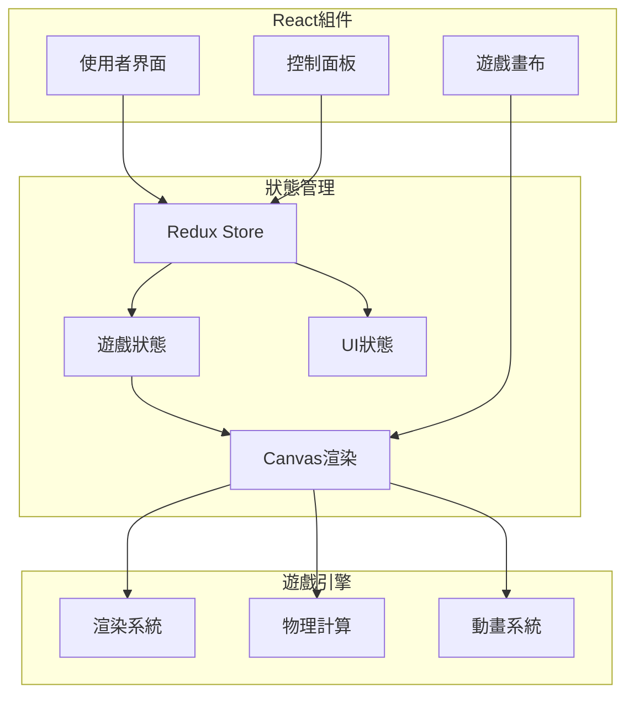
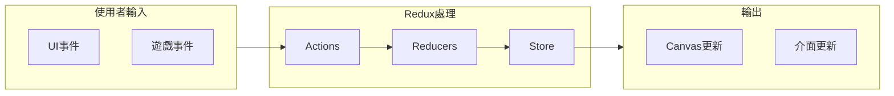

# 系統架構與設計模式

## 系統架構概覽



## 核心設計模式

### 1. Flux 架構
- 使用 Redux 單向數據流
- Action 觸發狀態更新
- Reducer 處理狀態變化
- Selector 優化性能

### 2. 組件化設計
- 功能組件優先
- Props 類型定義
- 自定義 Hooks
- 組件複用策略

### 3. 狀態管理
- Redux 集中管理
- 本地狀態管理
- 緩存策略
- 性能優化

### 4. 觀察者模式
- 事件訂閱系統
- 狀態變更通知
- 組件間通信
- 異步處理

## 主要系統組件

### Canvas 引擎
- 場景管理
- 精靈系統
- 碰撞檢測
- 動畫控制

### 遊戲邏輯
- 遊客行為
- 設施運營
- 經濟系統
- 天氣效果

### UI系統
- 控制面板
- 狀態顯示
- 互動選單
- 反饋系統

## 數據流架構



## 擴展性考慮

### 模組化設計
- 高內聚低耦合
- 插件式架構
- 動態載入
- 配置驅動

### 效能優化
- 記憶體管理
- 渲染優化
- 狀態更新優化
- 事件節流

### 可測試性
- 單元測試
- 組件測試
- 狀態測試
- 效能測試

## 主要設計原則

### 組件設計
```typescript
// 功能組件範例
interface AttractionProps {
  id: string;
  position: Vector2D;
  onSelect: (id: string) => void;
}

const Attraction: React.FC<AttractionProps> = ({
  id,
  position,
  onSelect
}) => {
  // 組件實現
};
```

### 狀態管理
```typescript
// Redux Slice 範例
const gameSlice = createSlice({
  name: 'game',
  initialState,
  reducers: {
    updateVisitors: (state, action) => {
      state.visitors = action.payload;
    },
    addAttraction: (state, action) => {
      state.attractions.push(action.payload);
    }
  }
});
```

### Canvas 管理
```typescript
// Canvas 管理器範例
class CanvasManager {
  private context: CanvasRenderingContext2D;
  private entities: Entity[];

  public render(): void {
    // 渲染實現
  }

  public update(deltaTime: number): void {
    // 更新邏輯
  }
}
