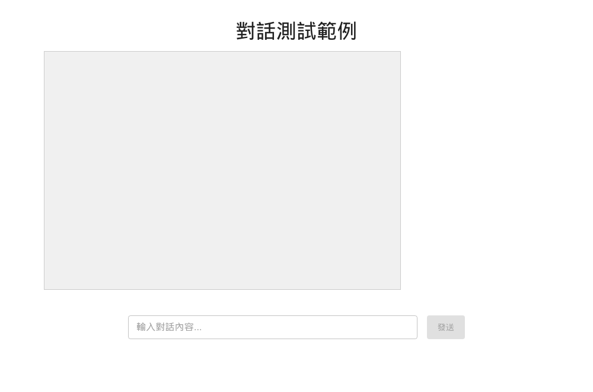
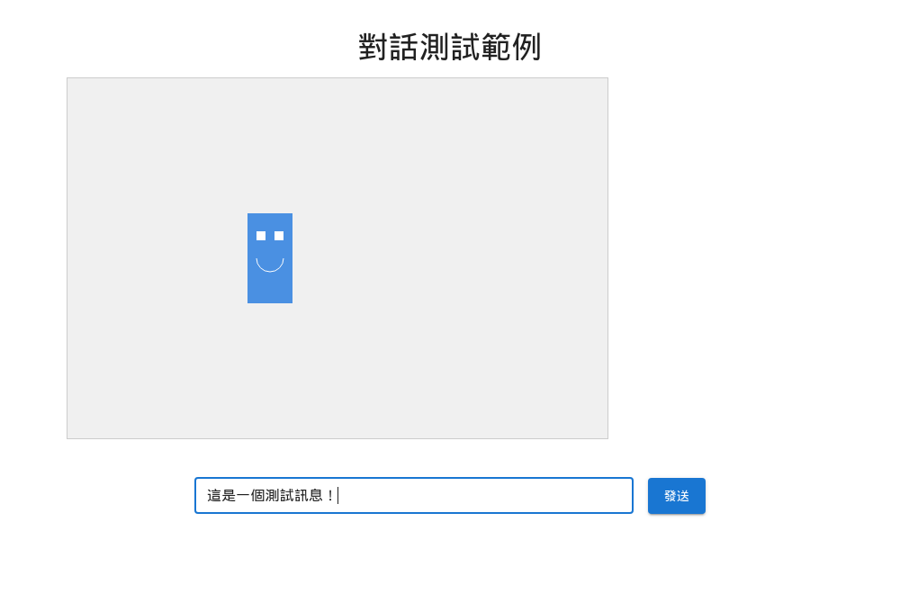
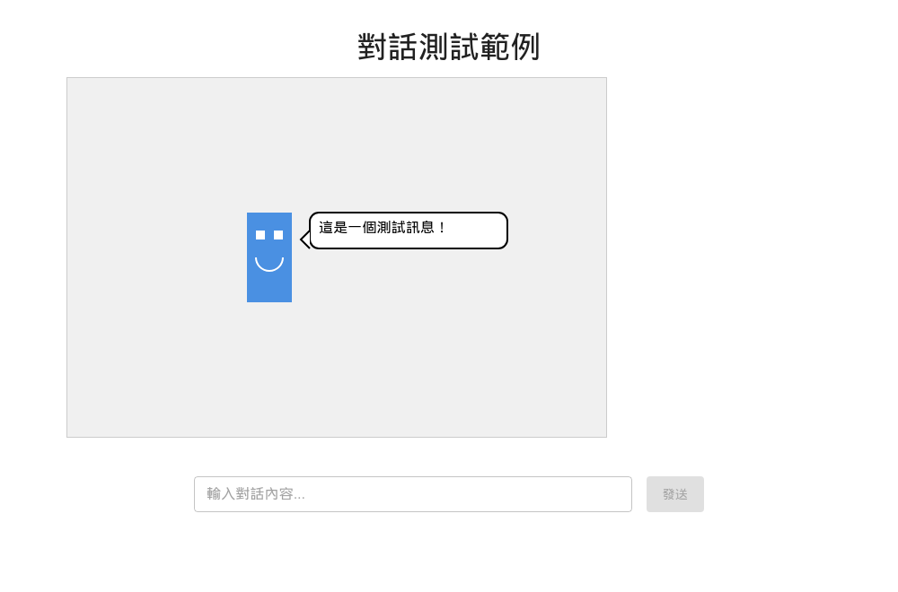
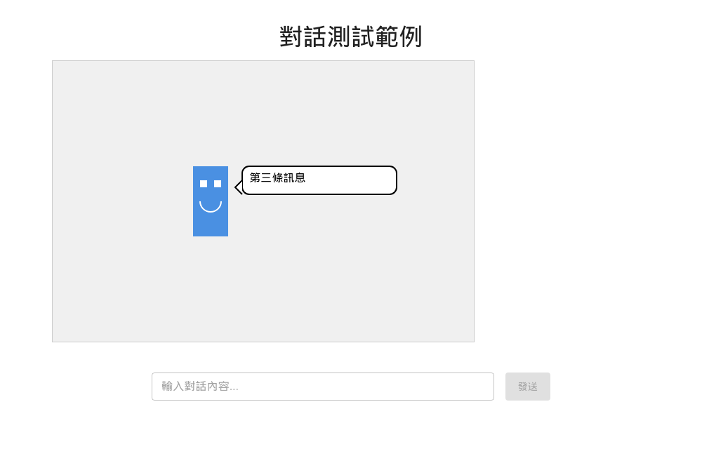

# 對話測試範例

這是一個示範如何使用 React + Canvas + Redux 實現對話功能的測試專案。專案展示了如何在畫布上繪製人物並讓其顯示對話內容，同時包含完整的端到端測試。

## 專案架構

```
dialog-demo/
├── src/               # 源碼目錄
│   ├── components/    # React 組件
│   │   ├── game/     # 遊戲相關組件
│   │   └── ui/       # 介面組件
│   ├── store/        # Redux 狀態管理
│   └── hooks/        # 自定義 Hooks
├── cypress/          # Cypress 測試
│   ├── e2e/         # 端到端測試
│   ├── support/     # 測試支援檔案
│   └── snapshots/   # 測試截圖
└── public/          # 靜態資源
```

## 測試結果展示

### 1. 初始狀態

- 頁面正確載入
- 顯示標題、輸入框和按鈕
- Canvas 畫布初始化

### 2. 輸入狀態

- 輸入框可接受文字
- 發送按鈕啟用
- Canvas 保持初始狀態

### 3. 對話框顯示

- 對話框正確渲染
- 顯示輸入的文字
- 角色狀態正確

### 4. 連續對話測試
#### 第一條訊息

- 第一條對話正確顯示
- Redux 狀態更新
- 介面響應正確

#### 第二條訊息

- 第二條對話替換顯示
- 狀態切換正確
- 動畫效果流暢

#### 第三條訊息

- 最終訊息顯示
- 完整功能驗證
- 所有狀態正確

## 功能特點

1. 對話系統
   - 使用 Canvas 繪製人物
   - 動態對話框顯示
   - 文字輸入介面

2. 技術實現
   - React + TypeScript
   - Redux 狀態管理
   - Canvas API 繪圖
   - GSAP 動畫
   - Material-UI 組件

3. 自動化測試
   - Cypress 端到端測試
   - 支援 headless 測試
   - Redux store 狀態驗證
   - 自動截圖保存

## 如何使用

### 安裝依賴
```bash
npm install
```

### 開發模式
```bash
npm run dev
```

### 執行測試
```bash
# 執行端到端測試（自動啟動開發伺服器）
npm run test:dev

# 開啟 Cypress 測試介面
npm run cy:open

# 執行 headless 測試
npm run cy:run
```

## 測試執行結果

```
執行時間: 12 秒
測試數量: 3
通過數量: 3
失敗數量: 0
截圖數量: 6
```

## 設計考量

1. 使用 Redux 管理狀態，方便測試和狀態追蹤
2. 採用 Canvas 實現繪圖，提供更好的性能
3. 整合 Material-UI，確保良好的使用者體驗
4. 完整的測試覆蓋，確保功能穩定性
5. 自動化截圖，提供視覺化的測試結果

## 注意事項

1. 此專案位於 tests/dialog-demo 目錄下，作為獨立的測試專案運行
2. 開發時確保端口 5173 未被占用
3. 執行測試前確保所有依賴已正確安裝
4. 測試結果會自動保存在 cypress/snapshots 目錄中
